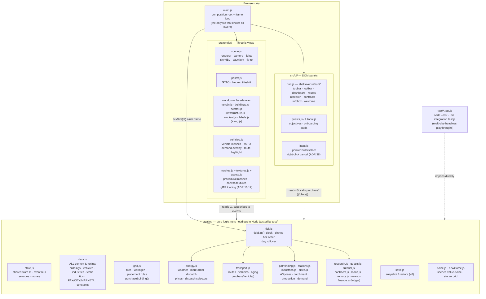

# Architecture & Design Decisions

## Overview

The game is plain ES modules with no build step, organized in **three strict
layers** plus a composition root. The rule that keeps everything testable:

> **`src/sim/` is the game.** It never imports Three.js or touches the DOM,
> so the entire simulation runs headless in Node (`npm test`).
> `src/render/` and `src/ui/` are *views* of sim state — they read the shared
> state object `G` every frame and react to sim events. Data flows down,
> events flow up.



Per-frame data flow — `main.js#frame` calls `tickSim(dt)` (`sim/tick.js`),
then the render/ui updates:

```
real dt → game minutes (8 min/s × speed, sim/tick.js)
  sim:    [midnight? rollOverDay: closeDay → rollFossilFreeDay → counter
           resets → dailyUpkeep → dailyLoanInterest → autoReplaceFleet]
          updateWeather → tickGrid → trackDay → tickIndustries → tickVehicles
          → tickCities → tickContracts → tickResearch → sampleHistory
  render: updateWorldRender (roads/rails dirty-rebuild, water, ambient life)
          → updateVehicleRender (mesh poses, FX, overlays) → updateDayNight
  ui:     updateQuestPanel → updateTutorialPanel → updateUI → render
```

The tick order is load-bearing (documented in `sim/tick.js`, pinned by
`test/tick.test.js`): dispatch needs fresh weather, report counters need the
fresh blackout flag, and industries deliberately read *last* tick's
demand-response flag.

### The event bus

`state.js` exports a 5-line emitter (`on`/`emit`). The sim announces what
happened; renderers and UI decide what that looks like. The important events:

| Event | Emitted by | Consumed by |
|---|---|---|
| `placed` / `bulldozed` | grid.js | render/buildings.js (create/remove building mesh) |
| `roadBuilt` / `railBuilt` | grid.js | render/infrastructure.js (mark instanced layer dirty) |
| `vehicleBought` / `wagonAdded` / `vehicleSold` / `vehicleReplaced` | transport.js | render/vehicles.js (mesh lifecycle) |
| `moneyFx` | transport.js | render/vehicles.js (floating +€ text) |
| `tip` | sim (various) | ui/hud.js (one-shot advisor toast, deduped via `G.firedTips`) |
| `toast` | quests.js, contracts.js, research.js, transport.js | ui/hud.js (generic toast) |
| `contractsChanged` | contracts.js | ui/hud.js (re-render 📜 tab) |
| `plantBuilt` / `stationBuilt` | grid.js | ui/hud.js (teaching tips) |
| `researchDone` | research.js | ui/hud.js (re-render 🔬 tab) |
| `dayReport` | reports.js | ui/hud/dashboard.js (pausing report modal; toast only while the tutorial runs — ADR 36) |
| `tutorialStep` / `tutorialDone` | tutorial.js | ui/tutorial.js (card advance / hide) |
| `questDone` / `contractDone` | quests.js / contracts.js | nobody yet — announced for future views (both also emit a `toast`) |
| `news` | news.js (via contracts/quests/energy/reports/research/transport producers) | ui/hud/news.js (ticker flash + unread badge) |
| `flyTo` | ui/quests.js | render/scene.js (camera tween) |

Adding an event: `emit('name', payload)` in sim, `on('name', fn)` in a view's
init function. Register listeners in init (after `resetState()` in tests) —
`G.listeners` is reset with the rest of the state.

This is also why **save/load is small**: `restore()` replays the player's
builds through the normal `place()`/`buyVehicle()` calls, and the renderer
rebuilds every mesh just by listening.

Because saves only store player deltas replayed onto a freshly-generated world,
**any worldgen change invalidates old saves** — a delta that landed on grass may
now land on water (or vice versa), silently mis-restoring. Version policy:
a non-worldgen field addition needs **no bump** (restore defaults missing
fields — that's how v2→v4 were absorbed historically), but a worldgen change
**bumps the version and rejects everything older** (v1→v2, and v5 — the WP6
river/lake). Today `restore()` accepts `v === 5` only; no migration code
remains. Pinned in `test/save.test.js`; the localStorage KEY is frozen at its
historical `-v2` suffix (see the note in `sim/save.js`).

## Key decisions (ADR-style)

### 1. Browser + Three.js, no build step
**Decision:** Plain ES modules, Three.js via CDN import map, served statically.
**Why:** "Run instantly on the user's machine" beat tooling comfort. No
node_modules, no bundler config, no version churn; `python3 serve.py` is the
whole toolchain. Three.js gives the modern look (PCF soft shadows, ACES
tonemapping, fog, emissive night windows) at zero install cost.
**Trade-off:** no TypeScript, no tree-shaking, CDN needed on first load.
**Consequence for contributors:** browsers cache modules aggressively; after
editing, force-refresh with `fetch(file, {cache:'reload'})` then reload
(see the `playtest-game` skill). `serve.py` sends `Cache-Control: no-cache`
to soften this.

### 2. Sim / render / ui layering (the testability decision)
**Decision:** All game rules live in `src/sim/` which imports neither
Three.js nor the DOM. Renderers subscribe to sim events and read `G`;
UI calls sim functions. `main.js` is the only file that knows all three.
**Why:** The simulation *is* the product (the teaching content); it must be
verifiable without a browser. `node --test` runs the whole suite in ~100 ms
with zero dependencies — cheap enough to run on every change.
**Consequence:** a feature = sim change + test + (optionally) a view change.
If you can't test it, it's probably in the wrong layer.

### 3. One shared state object instead of ECS/framework
**Decision:** `sim/state.js` exports a single mutable `G`; modules import and
mutate it. `resetState()` restores a pristine `G` for tests.
**Why:** The sim is small (a few hundred entities); an ECS or store layer
would be ceremony. Everything inspectable as `window.G` in DevTools — which is
also how the game is play-tested programmatically (`window.DEBUG`).

### 4. All tuning data lives in `sim/data.js`
**Decision:** buildings, vehicles, industry chains, research tree, advisor
texts and encyclopedia are pure data in one file.
**Why:** The teaching mission means numbers get revised against reality often;
balance changes must not require touching sim code. Every number's real-world
anchor is documented in [ENERGY-MODEL.md](ENERGY-MODEL.md).

### 5. Single "copper plate" grid, no transmission
**Decision:** One region-wide energy balance; no power lines or grid topology.
**Why:** The lesson hierarchy is: (1) variability of renewables, (2) storage
economics (battery vs H₂), (3) flexible demand. Transmission is lesson #4 and
would double UI complexity (line building, congestion). Deliberately deferred.

### 6. Merit-order dispatch with storage as the only dispatchables
**Decision:** every tick: renewables → (surplus: battery charge → electrolyzer
→ curtail) / (deficit: battery discharge → fuel cell → blackout).
**Why:** This mirrors how a 100%-renewable grid actually balances, and each
branch of the dispatch IS a teaching moment (curtailment tip, blackout tip,
flexible-demand tip). The electrolyzer is modeled as *flexible load that only
consumes surplus* — the single most important modern-grid concept the game
teaches. **This ordering is pinned by `test/energy.test.js` — don't change
one without the other.**

### 7. The player is the utility
**Decision:** cities & industries pay the player €85/MWh served; blackouts
forfeit revenue, halt industry, stop trains and shrink cities. Fleet charging
is unbilled (it's the player's own load).
**Why:** In OpenTTD energy would be a cost line; making it a *revenue stream*
makes the energy game a first-class economic loop instead of a chore, and
naturally rewards reliability — exactly the real-world incentive.

### 8. Tile world + graph roads, full 3D rendering
**Decision:** 192×192 logical tile grid (placement, A*, occupancy) under a
continuous displaced-plane terrain; cities generate their own street grids
which player roads connect to; rivers crossable via bridges (5× cost).
Rail is a *flag* on tiles, not a tile type, so roads and rails cross at level
crossings. The world is deterministic from a fixed seed (`WORLD_SEED`), which
is what lets saves store only the player's deltas.
**Why:** Tiles keep simulation and placement trivial (OpenTTD heritage);
the smooth mesh + lighting carry the visual ambition. Vehicles do A* over
road (or rail) tiles, so player roads, city streets and bridges form one
network.

### 9. Ambient life is cosmetic and instanced
**Decision:** ambient cars/pedestrians are `InstancedMesh` agents doing random
walks on street tiles (peds drift toward bus stops), count scaled by
population. They live entirely in `render/ambient.js` — the sim doesn't know
they exist.
**Why:** The requirement is the world *feels* alive. Agent-based citizen sim
costs enormous complexity for no teaching value. Two instanced draw calls give
hundreds of moving entities at negligible cost.

### 10. Passengers are demand pools with destinations
**Decision:** each city accumulates travellers (local + gravity-model split to
*neighbouring* cities only — the relative neighbourhood graph built in
`grid.js buildCityNeighbors`, where two cities are neighbours unless a third
sits between them); they walk to a stop only if a vehicle-staffed route
through that stop can actually deliver them (local = 2nd stop ≥5 tiles away
in the same city; intercity = a stop near the destination). Vehicles carry
typed groups and get paid per delivered passenger (€9 local / €24 intercity,
distance bonus). Happiness likewise only asks for links to neighbours.
**Why neighbours only:** on the 8-city map, all-pairs demand meant every city
wanted direct lines to seven others — unreadable overlay, unwinnable
happiness, and no reason for a hub-and-spoke network. The RNG graph contains
the minimum spanning tree, so the whole region is still reachable via
neighbour hops, and central cities naturally become transfer hubs. Non-
neighbour pools are actively drained each tick so stale saves can't strand
phantom travellers — *except* each city's 1–2 seeded "express destinations",
the long-haul exception added in ADR 35.
**Why:** "carry pax between two cities" alone made intra-city lines useless
and demand invisible. Pools + the 👥 demand overlay (V) turn passenger work
into a read-the-map puzzle, and the no-clogging rule keeps stops from filling
with travellers nobody serves.

### 11. Trains are grid-coupled, battery-free
**Decision:** locomotives draw ~1 MW live traction power while moving; a
strained grid slows them, a blackout stops them. Capacity comes from wagons.
**Why:** That's how real electric railways work (catenary, no battery), and it
closes the loop between the two halves of the game: your railway is only as
reliable as your grid.

### 12. Teaching via event-triggered advisor, not tutorial gates
**Decision:** ~15 one-shot tips fire when the *simulation* first produces the
phenomenon (first curtailment, first blackout, Dunkelflaute warning, storm
cut-out…), plus a passive encyclopedia tab and three quest chains that
sequence the arc without gating the sandbox.

### 13. Time scale
**Decision:** 1 game day = 3 real minutes at 1× (speeds ×1/×3/×10, pause);
seasons of 7 days change day length, solar yield, wind and heating demand.
**Why:** Solar's day cycle is the core rhythm; it must be observable within a
play session. Winter (short days, high demand) is the argument for hydrogen.

### 14. Zero-dependency test suite
**Decision:** `test/` uses Node's built-in runner (`node --test`), importing
`src/sim/` directly. `package.json` exists only for `npm test` and
`"type": "module"` — there are still no dependencies to install.
**Why:** The no-build philosophy extends to testing: cloning the repo and
running `npm test` must always work offline in under a second.

### 15. Rendering pipeline: physical sky, IBL, post-processing
**Decision:** `render/scene.js` renders a physical `Sky` dome (three.js addon,
r185+) whose sun tracks the game clock and whose procedural cloud cover is
driven by the sim's `G.cloud` — an overcast sky *is* the reason solar output
is low. A second, sun-disc-less Sky instance is baked into a PMREM environment
map (re-baked whenever the sun has moved enough) so PBR materials get sky
bounce light. `render/postfx.js` owns the frame composition: render →
GTAO → bloom (HDR, threshold above sun-lit whites so only emissives glow) →
tone map → screen-space tilt-shift whose strength scales with zoom-out.
`DEBUG.setPostFX(false)` falls back to a plain render for weak GPUs.
**Why:** IBL + ambient occlusion + the "miniature" tilt-shift are what make a
low-poly city read as a modern city-builder; all of it is post/lighting, so
the sim and content layers are untouched.
**Traps:** the bloom threshold (3.4) must stay above the HDR luminance of
sun-lit white surfaces (~2.8) or the whole city glows; night window emissive
(4.5) must stay above it. r185 removed `PCFSoftShadowMap` — its lazy fallback
leaves compiled materials without shadow lookups, so the renderer must be
configured with `PCFShadowMap` explicitly.

### 16. glTF assets from scripted Blender (graphics phase 2)
**Decision:** Real 3D models replace the box geometry incrementally, one type
at a time (pilot: the wind turbine; the gas plant followed in ADR 40). Each asset is generated by a
deterministic Python script in `tools/models/` run through headless Blender
(`tools/build-models.sh`), and the resulting `.glb` is committed to
`assets/models/` — players download static files, never run tooling.
`render/assets.js` loads them all once at startup (`await loadModels()` in
`main.js`, top-level await, before `initWorldRender`); `buildPlantMesh(type)`
returns a glTF instance when one exists and falls back to the procedural
mesh otherwise, so a missing/failed asset degrades gracefully.
**Why:** scripted Blender keeps assets reproducible and diffable (the script
is the source, the GLB a build artifact small enough to commit), preserving
the no-build-step rule at play time. See `docs/GRAPHICS-PHASE2-PLAN.md`.
**Traps:** `loadModels()` must complete before the render layer subscribes to
`placed` — save restore replays `place()` during init. Rotor nodes must
export with identity rotation (world.js animates `rotation.x` directly);
`tools/models/wind_turbine.py` documents how. Node/material names are API:
`assets.js` looks nodes up by name (`rotor`), so keep them stable across
regenerations. glTF materials arrive as `MeshStandardMaterial` — don't
re-wrap; keep roughness ≥ ~0.5 on whites (bloom threshold, ADR 15), keep
metalness ≤ ~0.25 on painted surfaces (metalness greys out albedo), and pick
albedos darker than the target look (noon ACES bleaches mid-tones).
`build-models.sh` finishes each asset with gltf-transform in dedup+weld-only
mode — join/flatten/palette would merge nodes and destroy those names, and
quantization re-centers vertex data into node transforms, breaking the
rotor's hub pivot and the raw-geometry building/tree preps (learned the hard
way: tiny city, off-axis rotors). City buildings and trees don't clone scene graphs: assets.js
merges them into instancing-ready geometries (flat material colors baked into
vertex colors; building windows keep a second material group whose emissive
map is the runtime-generated night-lights atlas).

### 17. Runtime canvas textures over world-space UVs (graphics phase 2)
**Decision:** The GLBs carry no image textures. Instead the Blender scripts
box/cylinder-project UVs in *world space* (1 UV unit = 1 world unit,
`common.py box_uv/cyl_uv`), and `render/textures.js` generates small tileable
canvas textures (brick, stucco, planks, corrugated metal, concrete, shingles,
PV cells, paving…) at load and attaches them to loaded materials **by
material name**. Each generator paints around the material's own base color
and the color then moves into the map (material.color becomes white) — the
authored palette (ADR 15/16 bloom/ACES tuning) is preserved exactly, and
per-instance tints keep working. City buildings merge into a material group
per texture category (flat/brick/plaster/window) with a per-model materials
array. World-space UVs mean texel density is uniform across parts of any
size, so one 128px texture serves every wall.
**Why:** keeps GLBs tiny and diffable (no binary image churn), matches the
existing runtime-canvas pattern (terrain, roads, window lights), and lets
textures be tuned in JS without a Blender round-trip.
**Traps:** all HSL color math in textures.js happens explicitly in sRGB —
three's linear working space makes dark colors' lightness tiny, and offsets
computed there blow the albedo far past the authored palette. And
`build-models.sh` must pass `--prune-attributes false`: gltf-transform
otherwise strips TEXCOORD_0 as "unused" (no material references an image),
which silently broke the building window-light atlas once before.

### 18. Terrain: baked biome map + tiling detail layer (graphics phase 2)
**Decision:** The ground keeps its single baked biome texture (3072px canvas,
`world.js bakeTerrainTexture`) for the macro look — river bed, sand banks,
grass patches, rocky highland. Close-up crispness comes from a separate
256px *tiling* detail layer (`makeGroundDetailMaps`): a hue-neutral grain
multiplied into the albedo via `onBeforeCompile` (reads as grass blades on
grass, granules on sand) plus a normal map from the same heightfield for
micro-relief. The detail repeats once per tile and fades out between 60 and
170 units of camera distance, so the repeat never shows as a pattern from
above.
**Why:** one all-island texture can never hold street-level detail (3072px ≈
4 texels per world unit on the 768-unit map); scaling it further costs quadratic bake time and
memory, while a small repeating layer is sharp at any zoom for free. The
detail noise is value noise on wrapped lattices so the texture tiles
seamlessly without mirroring artifacts.
**Traps:** the detail albedo is deliberately *linear* (no sRGB flag) and
centered on gray 128 — the shader multiplies `detail × 2`, so a mean of 0.5
leaves overall brightness unchanged. Per-map `repeat` on the normal map only
works because three r152+ gives every texture its own UV transform.

### 19. Detailed vehicles & citizens (graphics phase 2)
**Decision:** The glTF vehicles (`tools/models/vehicles.py`) and the instanced
ambient life (`world.js`) get real detail instead of flat-colored boxes.
Vehicle bodies are edge-beveled (a new `common.py bevel()` — angle-limited
modifier + box-UV reprojection + smooth shading), wheels are two parts (dark
tyre + a bright alloy rim that pokes through both sides), and each vehicle
gains headlights/taillights, side mirrors, a grille/destination sign and
window pillars that break the glass band into panes. Head/tail lamps are
*emissive*: `common.material()` now takes `emit`/`emit_str`, exported as glTF
`emissiveFactor` + `KHR_materials_emissive_strength` and kept verbatim by the
loader (they read as lit lamps at night, tuned below the bloom threshold).
Painted panels and tyres pick up subtle runtime textures by material name
(`textures.js` `vehiclePaint` — metallic flake + clear-coat sheen, matte; and
`tyre` — tread lugs + circumferential grooves). Ambient cars go from body+cab
to body + greenhouse + tinted glass + four wheels; pedestrians go from a
single capsule to trousers + torso + skin head. Both stay ONE `InstancedMesh`
each: a per-part vertex-color multiplier gives fixed-dark parts (glass, tyres,
trousers) while `setColorAt` still tints the body/shirt per instance.
**Why:** vehicles and citizens are what the eye tracks, so they gained the
most from box → real geometry; keeping ambient life single-instanced preserves
the ADR 9 "cosmetic and instanced" budget (still 121 fps orbiting, 160 cars +
240 peds). Emissive lamps reuse the existing material path rather than a new
night hook — vehicles have no `setNightAmount` wiring and modest emission looks
right day and night.
**Traps:** `bevel()` must run *before* `join_parts` (per-object modifier) and
re-project box UVs (new bevel faces have no coords); it only fits box-projected
parts. Keep `emit_str` below the bloom threshold (~3.4) or lamps flare in sun.
The vehicle-paint texture must stay near-flat (tiny lightness spread, no bump)
or painted bodies bloom — same rule as ADR 16. Ambient vertex colors are
*multipliers*, not final colors: a part tinted white takes the instance color,
a part tinted gray stays that gray whatever the body color.

### 20. 4× world: 192×192 tiles, 8 cities, multi-producer chains
**Decision:** the map grew from 96×96 to 192×192 tiles (4× area) with 8 cities
and 9 industries (2 mines, 2 steel works, 3 farms, 2 food plants), so every
cargo chain has alternative producers and intercity routes have real length.
City density is deliberately *below* the old map's (8 instead of a
proportional 12) — distance is the point. Both mines sit east of the river so
west-bank steel keeps the bridge lesson. The starter grid and the storagePlay
quest target scaled with regional demand (~23 MW evening peak) to keep the
same early-game margins. Save version bumped to v2 (new localStorage key):
v1 saves store tile coords of the old world and would silently mis-restore;
the old key is left untouched rather than deleted.
**Why 8 cities / 9 industries:** enough that route choice becomes a decision
(which farm feeds which food plant, rail vs truck over 60-tile hauls) without
multiplying early-game demand beyond what a teaching-sized starter grid can
serve.
**Traps:** anything that scales per-tile (terrain bake, tree scatter, detail
repeat) must derive from `G.N`, not literals — the terrain texture and
`DETAIL_REPEAT` both bit on this. Tests keep synthetic road/rail fixtures in
the empty south-west (i 1–21, j 84–92); new cities must stay clear of it.

### 21. Legacy gas bridge & rising carbon price (amends ADR 6)
**Decision:** every new game starts with exactly one inherited 30 MW gas plant
(`legacy: true` in `data.js` — hidden from the build palette, players can
never build fossil capacity). It extends the pinned merit order by one step:
deficit → battery → fuel cell → **gas** → blackout. Each gas MWh costs fuel
(€70) plus `co2PerMWh × G.carbonPrice`, with the carbon price starting at
€30/t and rising €3 per game day (`data.js` CARBON block); emissions accrue
in `G.co2EmittedTons` next to the existing avoided-CO₂ ledger. A one-time
decommission grant (€60k) removes the plant irreversibly, and a "fossil-free
week" quest (7 consecutive days with zero gas) is the game's de-facto win
condition.
**Why:** headless experiments showed the starter grid blacks out from day 5
with no early-game defense — new players lost to weather before the teaching
arc began. A *bridge* plant keeps the lights on early while the carbon ramp
guarantees it becomes a loss-maker (break-even ≈ €33/t, i.e. day 2), turning
the whole game into the real energy-transition problem: phase out fossil
without blackouts. ADR 6's "storage as the only dispatchables" becomes
"…plus a single legacy gas plant whose phase-out is the game arc."
**Invariant (tested):** fossil must never be the profitable long-run answer —
gas margin is negative once carbonPrice > €35/t.
**Shared-state contract** (pinned in `state.js`, save v3): `carbonPrice`,
`co2EmittedTons`, `gasMWhToday`, `gasCostToday`, `fossilFreeDays`,
`gasDecommissioned`, `supply.gas`, plus `weatherFront`/`forecast` (ADR-noted
under F2), `reports` (daily report cards), `marketLive`/`price` (ADR 22).
Save format bumps to v3 under the same localStorage key; v2 saves still
restore (same world seed) and simply have no gas plant — it is only placed
for new games.

### 22. Smart Market: dynamic electricity pricing (supersedes the "no dynamic pricing" limitation)
**Decision:** on game day 8 the regulator *announces*, and on day 10
*activates*, the Smart Market: the flat €85/MWh is replaced by a live price
`G.price` set each tick by teachable rules, in priority order — scarcity
(unserved demand) €240 · gas running: gas marginal cost + €15 (the most
expensive running plant sets the price — the merit-order lesson) · surplus
being curtailed €25 · otherwise €45→€120 interpolated by residual load
(demand − renewables) against the evening peak. Revenue = billable MW ×
current price; constants live in `data.js` MARKET.
**Why:** with a flat tariff, storage only prevents *losses*; real grids pay
for flexibility. Once batteries and fuel cells discharge into €240 scarcity
prices, storage arbitrage becomes the business model — and the two-day
announcement window teaches players to prepare, mirroring how market reforms
actually arrive. The day-10 start protects the early game (players learn the
basics on a predictable tariff first).
**Trade-off:** income becomes weather-correlated; balance is checked by a
15-day headless run against the flat-price baseline (±30 % band) — tune the
band constants, not the mechanism.

### 23. Weather fronts with lead time
**Decision:** the hourly weather roll no longer applies Dunkelflaute/storm
instantly; it schedules a front on `G.weatherFront` with 10–14 h lead time
(`data.js` FORECAST), applied unchanged when the countdown ends, with a
derived `G.forecast` outlook and a warning banner/advisor tip at schedule
time. **Why:** this turns the Dunkelflaute from an ambush into a planning
problem — the event stays exactly as hard, players just get the real-world
day-ahead-forecast window to charge storage; it also softens the day-3 grace
analysis of ADR 21, since the first flaute now announces itself ~half a day
early. The forced-event debug path (`G.dunkelflaute = 40` applies on the next
tick) is preserved and pinned by `test/weather.test.js`.

### 24. Climate feedback: emissions load the weather dice
**Decision:** the lifetime CO₂ emitted by the gas plant multiplies the hourly
*extreme*-event probabilities (storm and the new summer-only **heatwave**) by
`min(2, 1 + emitted/1500 t)` — the base Dunkelflaute roll stays unscaled, since
a dark calm is ordinary weather variability, not a warming signature. The
heatwave rides the ADR 23 front pipeline (scheduled 10–14 h ahead, forecast +
banner) and models a heat dome: city demand ×1.3 (air conditioning) while the
wind drift target is capped low (stagnant air) and skies stay clear (solar
strong). **Why:** it closes the game's causal loop — gas → CO₂ → worse
weather → harder grid — which is climate attribution in miniature, and it
gives the emitted-CO₂ ledger (ADR 21) a consequence beyond the carbon bill.
All constants live in `data.js` CLIMATE; the 2× cap keeps it teaching, not
punishment. Active state `G.heatwave` (+ `heatHoursToday`) persists as
backwards-safe v3 save fields — no version bump.

### 25. Grid-import interconnector (extends the ADR 21 merit order)
**Decision:** a buildable 12 MW HVDC **Interconnector** adds one deficit step:
battery → fuel cell → **import** → gas → blackout. Imports cost the
neighbour's price (€95/MWh normally) and put the neighbour's mix CO₂
(0.25 t/MWh) on the player's *emitted* ledger (climate dice included, avoided-
CO₂ credit excluded). While a Dunkelflaute or heatwave is active the link
carries only 30 % of its capacity at €220/MWh — weather systems are
continental, the neighbours are short too. On the Smart Market the most
expensive *running* dispatchable sets the price: `max(gas ask, import ask)`
where the import ask is its current price + €10. Constants in `data.js`
`INTERCONNECT`; capacity registers like storage (`G.importCapMW`).
**Why:** interconnection is the real fourth tool of grid planners (after
generation, storage, flexibility) and it gives players a fossil-free path to
retire the gas plant — imports clear *before* gas because the carbon ramp
pushes the gas marginal cost past €95 within days (a deliberate fixed-order
simplification of true merit order; for the first ~2 days gas would actually
be cheaper). The event throttle preserves the teaching invariant that a
Dunkelflaute must not be escapable by wire alone, and the €95-vs-€85 flat
tariff spread keeps imports an insurance product, not a business model.
Imports do **not** break the fossil-free-week streak (that quest is about the
player's own plant) — but the CO₂ ledger and the ADR 24 climate feedback see
them, so "fossil-free by import" is visibly not emissions-free.

### 26. H₂ offtake: hydrogen becomes a product (sector coupling)
**Decision:** a buildable **E-Fuel Refinery** sells up to 4 MW (chemical) of
grid hydrogen into offtake contracts at €95/MWh — but only the amount above a
**40 % tank reserve**, which is never sold (`data.js` H2OFFTAKE,
`energy.js#tickGrid` after dispatch). Sales are chemical, not electrical: they
never appear in the merit order or set the power price. Each sold MWh credits
0.25 t *avoided* CO₂ (e-fuel displaces fossil kerosene/diesel downstream). A
new energy quest ("🛢 Hydrogen economy", 300 MWh sold) follows the H₂-reserve
quest.
**Why:** with only the fuel cell as H₂ sink, overbuilt electrolyzers were dead
capital outside Dunkelflauten; an offtake contract makes routine surplus →
molecules a business — the real sector-coupling story. The price is pinned
between the €25 surplus power value and a scarcity fuel-cell discharge
(0.58 × €240 ≈ €139/MWh chemical), so selling routine surplus pays while
hoarding for emergencies pays better; the hard reserve keeps the teaching
invariant that a Dunkelflaute must remain survivable — the game never lets
the player's insurance be quietly sold out from under the fuel cells.

### 27. Vehicle aging & fleet renewal (save v4)
**Decision:** vehicles accrue calendar age (`v.ageDays`, ticked in
`tickVehicles`). Past a 10-day grace period, daily upkeep ramps +10 % of the
base rate per day (capped 3×, billed via `transport.js#vehicleUpkeep` from
`dailyUpkeep` and the report card) and EV packs lose 1.5 %/day of usable
capacity (floored at 65 %, `effectiveBatteryKWh`) — old trucks run shorter
legs and charge longer. `replaceVehicle()` trades in for 75 % of list price
and resets the clock; a per-route **auto-replace** flag renews ≥22-day
vehicles on the day rollover (`autoReplaceFleet`, called from `sim/tick.js`).
Constants in `data.js` AGING. Save format bumps to **v4** (same key): vehicle
`age` and route `autoReplace` persist; v2/v3 saves restore with everything
grandfathered in at age 0.
**Why:** without depreciation, a bought vehicle was a solved problem forever;
now fleets have the real operator's renewal trade-off (maintain vs replace),
and pack degradation ties transport back into the energy game — worn EVs
spend more time on the chargers your grid feeds. Numbers are gentle: a
never-replaced truck costs ~€90/day extra at the cap, noticeable in the
report card, never fatal.

### 28. Milestone-gated build palette (amends ADR 12's "no tutorial gates" — for buildings only)
**Decision:** advanced buildings unlock as play progresses: rail + rail
stations after the first freight-chain objective (`grainChain`), the whole H₂
chain (electrolyzer/tank/fuel cell) after the battery objective
(`storagePlay`), the e-fuel refinery after the H₂-reserve objective, and the
interconnector when the Smart Market goes live (day 10). Lock state is
**derived live** from `G` (`data.js` UNLOCKS predicates, `grid.js#isUnlocked`)
and never stored — loading a save recomputes it. Only the *palette* is gated:
locked tools render greyed with a 🔒 and clicking shows the unlock hint;
`canPlace()`/`place()` stay lock-free because the save replay, the starter
grid and the DEBUG API all go through them (a lock there would silently drop
restored buildings — pinned by test).
**Why:** the day-one palette had grown to 13 buildings across three systems;
new players built electrolyzers before understanding batteries and the
teaching sequence (variability → daily storage → seasonal storage → markets)
was skippable. The gates follow the existing quest chain, so they add no new
bookkeeping, and old saves simply start with whatever their progress already
earned. ADR 12's principle survives: the sandbox isn't paused or railroaded —
locked options are visible with a clear path to earn them.

### 29. Guided onboarding tutorial (opt-in, state-detected, never gating)
**Decision:** new games offer a 🎓 tutorial on the welcome screen (primary
button; "Free play" skips it silently). Nine steps walk the core loop —
camera, dashboard, first solar + battery, two bus stops, route, e-bus, first
riders, the objectives panel. Step definitions and completion logic live in
`sim/tutorial.js` (quest-style: polled `check()` predicates against `G`,
relative to baselines captured at start so the starter grid never counts);
the card UI, DOM highlighting and camera-move detection live in
`ui/tutorial.js`. Steps the sim can't see (camera moved, tab opened, quest
expanded) are reported by the UI via `notifyTutorial(flag)` — a plain sim
function call, honoring the layering rule. Each step carries a semantic
`highlight` key (`tool:solar`, `tab:routes`, …) that the UI maps to a
selector and pulses. Every step pays cash (€5–15k) and completion pays a
€25k graduation bonus, announced through the existing `toast` event.
`G.tutorial` persists in the save (optional field, no version bump); saves
without it restore as `done` so existing players are never onboarded.
**Why:** the welcome card + advisor tips explained the game but never made
the player DO anything — the first minutes decide whether a new player finds
the loop. ADR 12's principle still holds, the same way ADR 28 amended it:
the tutorial observes state, it never pauses or locks the sandbox, every
step can be completed out of order (checks are cumulative and cascade), and
it is skippable at any moment. Detection-by-state means the tutorial needs
no special hooks in game rules — it reads the same counters quests do.

### 30. Retail economics: grid fee, windfall levy, VoLL, industrial demand response
**Decision:** energy billing nets `min(P,100) + 0.2·max(0, P−100) − €18/MWh`
(windfall levy + grid operations fee, `data.js` TARIFF), every unserved MWh
costs €500 blackout compensation (VOLL), and all industries pause while
`G.price ≥ 150`, restarting below €100 (hysteresis on `G.indCurtailed`, set in
`tickGrid`, consumed by `tickIndustries` one tick later). The starter grid
shrank (4 wind, 3 solar, 1 battery) so the gas plant runs nightly from day 1;
energy capex, research costs, cargo pays, contract bonuses and energy-quest
rewards were re-tuned around the new margins.
**Why:** 30-day headless policy runs (passive vs scripted "smart player")
showed the old economy rewarded failure: scarcity pricing billed the player's
own captive customers with no cost for unserved load, so the most profitable
days were the ones with 6+ h of blackouts, a passive player nearly tripled
their money doing nothing, and gas setting the price inflated revenue on every
renewable MWh (inframarginal windfall). All three counter-mechanisms are real
policies (EU 2022 revenue cap, VoLL-based outage fines, industrial
curtailment), so the fix deepens the teaching instead of patching around it.
The re-tuned reward channels move the profit engine to things only an active
player does: transport chains (pays > passive grid margin), displacement of
gas/import costs, storage arbitrage, quest/contract completion. Verified by
re-running the policy harness: passive ends ~+75% over 30 days with scary
negative event days; a thorough player ends ~+130-155% in cash **plus** the
infrastructure. Trade-off: the fossil-free endgame is intentionally hard —
decommissioning gas before firm clean capacity exists now hurts (keeping the
plant idle is the smart bridge), which mirrors reality's capacity-reserve
debates. The harness is checked in as `tools/policy-runs.mjs`
(`node tools/policy-runs.mjs`): six scripted 30-day policies (passive,
winter-start passive, bus line, freight chain, express rail, contract
chasing) run headless through the real `tickSim` pipeline and print a
comparison table — re-run it after any economy rebalance instead of tuning
by feel. Its weather draws are unseeded (`Math.random`), so cross-scenario
end-money deltas need the built-in multi-seed averaging; isolated route P&L
(`route.earnedTotal − spentTotal`) is the weather-independent signal.

### 31. Graphics phase 3 — the approved Board 07 look (detailed assets + living landscape)
**Decision:** rebuild every model at much higher detail and give the world a
from-scratch nature pass, matching art-direction **Board 07** (approved July
2026; see `docs/GRAPHICS-PHASE3-PLAN.md` and `docs/art-direction/`). Nine work
packages, one commit each, all in `src/render/` + `assets/` + `tools/` except
the single sim change in WP6:
1. **Style guide + pilot building** (`tools/models/STYLE.md`, `plaster_low`
   house) — the window-module / floor-height / cornice-plinth-parapet spec,
   preserving the night-light UV atlas (glass parts keep their 8×8 atlas cell).
2. **Full building set** — 3 styles × 3 tiers + 2 seeded variants each, with
   balconies, rooftop AC/bulkheads and glass mullion grids.
3. **Trees** — oaks (branch cylinders + two-green displaced lobes), layered
   conifers, poplars, and a new birch species; one InstancedMesh per species.
4. **Turbine + props** — three-blade rotor (outward-only blade geometry fixes
   the 6-spoke bug), per-instance rotor phase, brighter street-lamp heads.
5. **Ground shader** — `onBeforeCompile` chunks on the terrain material blend
   grass patchwork / dirt / slope rock / waterline sand, keeping fog, shadows
   and GTAO intact.
6. **River (the only sim change)** — a seeded meander carves the heightfield
   into a south-east lake, moving which tiles are water/grass (see save-version
   note below).
7. **Ground scatter** — seeded InstancedMesh grass tufts, wildflowers, bushes,
   slope-biased boulders and shore reeds, excluding roads/pads/footprints.
8. **Farmland patchwork** — fenced crop fields near farm industries; purely
   visual worldgen decoration, no sim meaning.
9. **Streets** — raised city curbs, dashed center lines on all roads, zebra
   crosswalks at city intersections; asphalt everywhere (no gravel variant).
**Save impact:** WP6 changes worldgen, so the save version bumped to **v5** and
**pre-v5 saves are rejected** (clean break, not migrated) — a player delta
replayed onto the moved terrain would silently mis-restore. Pinned in
`test/save.test.js`; rationale under "Persistence" below and ADR 20's precedent.
**Contracts preserved across every WP** (ADR 16/17): object/material names are
load-time API (`<style>_<tier>`, `rotor`, `glow`, `bldg_window`), the night
window atlas, `userData.rotor` spin, solar dark at night, bloom threshold ≈ 3.4
capping every emissive, metalness ≤ 0.25 on paint, albedos darker than target
(ACES bleaches mid-tones).
**Calibration (WP10):** in-game aerial / landscape / street captures were
compared side-by-side against the three Board 07 reference renders. The phase-1
lighting/post rig (`scene.js` sun + exposure 1.05 + Sky/IBL, `postfx.js`
GTAO/bloom/tilt-shift) already matched the approved look — sun direction and
warmth, soft moderate shadows, muted natural greens, calm pale sky — so **no
sun/exposure/saturation values were changed**. Exposure is a shared day/night
knob; the readable-night floor (ADR 15, teaching mission) outranks a marginal
daytime tweak. Night verified: lit windows, glowing lamp heads, solar dark,
emissives held under the bloom cap. **~141 fps** orbiting the city center
(timed `renderPostFX()` loop), comfortably over the ≥55 budget.
A final coordinator verification pass then re-tuned four world-layer values
against the boards (all in `render/world.js`): the dirt mask now uses fbm
noise like the look-dev's fractal TexNoise (single-octave noise at the same
ramp covered ~⅓ of the map in bare patches), the shore-sand band was
tightened (the game's unclamped lowlands turned every pond basin into a huge
beach; look-dev clamps its land above the full-sand line), water became
darker and calmer (weak rough clearcoat + fine ripple repeats — a strong
coat with ~16 world-wide repeats mirrored the sky as giant white sheen
blobs), and reed count rose 150 → 420 so river banks read as "reeded" from
the reference altitude. ~212 fps after the pass.
**Why:** the box-and-flat-color world of phase 2 read as a prototype; the
Board 07 detail pass makes it read as a finished modern city-builder while the
sim and content layers stay untouched (all detail is assets + render + one
worldgen change). ENERGY-MODEL.md is unaffected.

### 32. Maintainability pass: sim heartbeat, domain modules, integration tests
**Decision** (July 2026): four structural changes, zero behavior change —
1. **`sim/tick.js` is the heartbeat.** `tickSim(dt)` owns the clock, the
   pinned tick order and the order-sensitive day rollover that previously
   lived inline in `main.js`; research progression moved from `ui/hud.js`
   into `sim/research.js` (it was the one game rule in the DOM layer). The
   whole game can now be played headless: `test/integration.test.js` runs
   multi-day playthroughs on the real starter grid (`sim/newGame.js`)
   asserting cross-system invariants every tick.
2. **The sim owns purchase rules and dispatch economics.** `purchaseBuilding`
   / `purchaseVehicle` / `purchaseWagon` charge and return reason codes the UI
   only translates; `energy.js` exports selectors (`gasMarginalCost`,
   `importCapNow`/`importPriceNow`, `h2Reserve`/`h2Sellable`) that both
   `tickGrid` and the infobox read. The money-free primitives
   (`place`/`buyVehicle`/`addWagon`) stay untouched — the save replay, the
   starter grid and DEBUG depend on them.
3. **Domain modules instead of mega-files.** `transport.js` split into
   `pathfinding` / `stations` / `industries` / `cities` + routes-and-vehicles;
   `render/world.js` into `terrain` / `buildings` / `scatter` /
   `infrastructure` / `ambient` (+ shared `rng`); `ui/hud.js` into a shell
   plus `ui/hud/*` panels. Every split is mechanical; facades keep the old
   import surfaces.
4. **Tuning knobs are data.** Passenger/city/freight constants moved to
   `data.js` (PAX, CITY, FREIGHT), tests read defs instead of pinning
   literals, and the transport/city balance is tunable without touching code.
**Why:** the codebase had doubled since ADR 2; game rules were leaking into
views and the two 1000+-line view files made every change a search problem.
The refactor restores the original contract — *if you can't test it headless,
it's in the wrong layer* — and gives balance work an executable harness
instead of hand-run playthroughs.

### 33. Self-enforcing architecture: guard tests instead of remembered rules
**Decision:** `test/architecture.test.js` turns the CLAUDE.md rules into
assertions that run with every `npm test`: sim purity (no three.js/DOM/
timers; localStorage only in save.js), no sim→view imports, a 600-line
file budget (data.js exempt), main.js stays a composition root, every source
module appears in this document's module map, every `emit('…')` event has a
row in the event table above, and the README's "N+ tests" claim stays a true
floor. Each failure message states the exact fix.
**Why:** the ADR 32 audit found exactly the drift these guards now catch —
game rules in the HUD, an untested rollover in main.js, a diagram four
modules behind, mega-files — all of which had crept in silently despite the
rules being written down. Documentation drifts; a red test does not. The
guards are deliberately coarse (string scans, line counts) so they stay
zero-dependency and obvious to fix — **do what the message says, never
weaken the guard to get green.**

### 34. Finance ledger: one categorized tally, not scattered counters (WP3)
**Decision:** every money mutation books into `G.ledger.today[cat]`
(`sim/finance.js#book`, +income / −expense) under a data-defined category
(`data.js LEDGER_CATS`, each with label/icon/color and an `invest`/`balance`
flag). `spend(cost, cat)` and `earn(v, cat)` (state.js) carry the category;
`rollLedgerDay()` archives today into `G.ledger.days` (28-day ring = one game
year) at the day rollover, right after `closeDay()` snapshots the same tally
onto the report card. Two nets are derived (`ledgerNets`): **netOperating**
(excludes `invest` capex) and **netTotal**; loan draw/repay carry `balance:
true` and stay out of both (balance-sheet, not P&L). The legacy scalars
(`incomeEnergyToday`, `gasCostToday`, per-route `G.finance.today`, …) are kept
and dual-written for the existing dashboard; the ledger is the new source of
truth for the stats modal, the money-hover breakdown and the daily report.
`REPORT_KEEP` rose 7 → 28 to match. Save v6 additive field `G.ledger`
(default empty on v5 loads — no new version bump).
**Why:** the old report was "all gray, all minus" — build costs vanished into
one `expensesToday` lump and the gas penalty was invisible. A per-category
ledger with an operating/total split makes the gas-fuel line legible against
real income and turns Finance into a readable P&L. **Invariant (tested,
`test/finance.test.js`):** the booked categories reconcile exactly to the
money delta over any played span — every mutation is booked.
**UI:** `ui/hud/statsModal.js` (opened from the 📈 topbar button and the money
hover) renders four tabs — Dashboard KPIs, Finance (income/expense trees +
28-day stacked bar chart with an "include investments" toggle), Energy (the
power chart), Cities — via the shared modal helper (ADR/D-B, `ui/hud/modal.js`).

### 35. Express pairs & richer contracts: long-distance demand (WP4)
**Decision (long-distance demand):** ADR 10 kept intercity travel between
*neighbours only* — but once every neighbour is linked, intercity work runs
dry. Worldgen now also assigns each city 1–2 **express destinations**: far
(> `PAX.expressMinDist` ≈ 60 tiles), non-neighbour cities, chosen
deterministically on a SEPARATE seeded rand stream (split-stream discipline,
like the river) so it never perturbs the shared `rand` the placement draws
from — worldgen stays byte-identical and no save bump is needed. Links are
symmetric (one route serves both ways). `tickCities` streams a share
(`PAX.expressShare` ≈ 0.15 of `want`) into those slots with their own cap
(`PAX.expressCap`); all *other* non-neighbour pools still drain to zero.
`routeServes`/`stationCatchment` need no change — any city on the route
qualifies — and pay already scales with distance, so express passengers are
naturally lucrative: rail's niche. Long-haul **passenger contracts** between
express pairs enter the contract pool too.
**Decision (contracts):** contract tuning moved out of code into
`data.js CONTRACTS` (offers/active caps, premium, per-cargo `sizes`, bonus
mult). Contracts are longer and richer — `days` 3–6 (was 2.5–3) with
proportionally larger targets, and the completion bonus is ≈4× raw cargo value
(was ≈2×). Each contract tracks `earned` (accumulated premium). The bare
`completed`/`failed` counters are gone: `G.contracts.history`
(`{...contract, outcome, closedDay, earned, bonus}`, bounded ring) is the
ledger of record and the counts are derived (`contractsDone`/`contractsExpired`).
Fulfillment fires a celebratory `moneyFx` at the destination on top of the WP1
news entry. Save v6 additive field (`G.contracts.history`, default `[]` on
older loads — no version bump).
**Why:** playtesters connected all neighbours and then had no passenger growth
left, and missed contracts entirely (bonus too small to chase, no record of
what they'd fulfilled). Express pairs keep the map's demand alive as a
long-haul rail game; the history + bigger bonus make contracts worth reading.
**Invariants (tested):** express pairs are deterministic, non-neighbour and
symmetric (`test/express.test.js`); express demand flows while other
non-neighbour pools stay empty; a headless multi-day run shows signing two
contracts clearly beats ignoring them (`test/contracts.test.js`). WP4 is
economically neutral for a *passive* player (no routes → no deliveries → no
contract income; express demand only pools).

### 36. Daily report: a pausing modal with problems & achievements (WP2)

**Problem:** the end-of-day report was an auto-fading bottom-left toast
(explicitly "never pauses") — at 3×/10× it vanished before it could be read,
its rows were all-gray-all-minus, and a city sliding into unhappiness or a
contract about to lapse never announced itself.

**Decision:** on `'dayReport'` the report opens through the shared modal
helper (ADR/D-B `ui/hud/modal.js`), which pauses the sim and restores the
prior speed on close — the game waits while you read. The body renders the
day's `report.ledger` snapshot as an income tree / operating-cost tree /
investments tree (green +, red −, ADR 34 categories), `netOperating` and
`netTotal` side by side, and the CO₂ + grid-quality row. **Exception:** while
`G.tutorial.active` it stays the old non-pausing toast so the scripted
onboarding flow isn't interrupted; from tutorial completion onward it's the
modal. The dashboard "Yesterday" block is untouched (the passive recap).

**Problems & achievements** are computed in `closeDay()` (sim layer,
`reports.js`), diffing yesterday's report card against today via a per-card
`cityStats` snapshot (`{name, happiness, foodLevel, goodsLevel, peak}`; `peak`
carries the all-time happiness high forward through the chain, so it survives
saves). Thresholds are data (`REPORT_ALERTS` in data.js). Problems: a city's
happiness dropped > 5 pts (the dominant negative `happinessFactors` gap is
named), blackout hours logged, a signed contract due within a day.
Achievements: food/goods crossing the well-supplied threshold upward, a new
happiness high above a celebration floor, fossil-free-streak milestones. Each
is stored on the report card (`report.problems` / `report.achievements`) AND
pushed to the news feed as `type:'city'` (ADR 34's producer list already
names reports.js) — so the same signal survives after the modal is closed.

**Invariants (tested, `test/reports.test.js`):** the card always carries both
arrays; day 1 has no baseline so no diff fires; each detector fires on its
scripted city/contract state and stays quiet below threshold; every detected
item also lands as `type:'city'` news. Modal pause/restore is a UI concern
verified in-browser (the sim-observable part is the card + news, asserted
headless).

### 37. Route management UX: loop-back editing & per-route economics (WP5)

**Problem:** four route pains surfaced in playtest. (1) Closing a loop:
players clicked the first stop again to "return home", but that *removed* it —
traversal was already circular (`stopIndex = (stopIndex+1) % stops.length`),
so re-adding the origin was never needed. (2) While editing you couldn't tell
which stations were addable. (3) A route's profitability was invisible —
income existed per route but costs vanished into global lumps. (4) The city
overcrowding warning and station infobox were dead ends.

**Decisions:**
- **Loop-back, not a data change.** `toggleRouteStop` now returns
  `'added'|'removed'|'finished'`. Clicking the **first** stop of a ≥2-stop
  route returns `'finished'`, clears `G.routeEdit` (like ✔ Done) and toasts
  "routes loop back automatically" — the origin is neither re-added (no
  duplicate) nor removed (no loss). Non-origin stops still toggle. Route cards
  draw the stop list as a cycle (`A → B → C ↻ A`). No save impact.
- **Addable-station highlight (render, no new event).** `render/vehicles.js`
  reads `G.routeEdit` in its per-frame `updateRouteHighlight`; while editing it
  draws pulsing green ground rings over every station matching the route's
  `routeKind` (a kindless empty route accepts any) that isn't already a stop.
  Read-only view of state, rebuilt on the same stop-signature change as the
  route line. (Dimming non-matching stations was left out — positively
  highlighting the addable set teaches the same thing without mutating shared
  station-mesh materials.)
- **Per-route lifetime economics (persisted, v6-additive).** Routes gain
  `spentTotal` / `earnedTotal`. `credit()` accrues delivery income to
  `earnedTotal`; `purchaseVehicle`/`purchaseWagon`/`replaceVehicle` book capex
  and `energy.js#dailyUpkeep` books each vehicle's upkeep to its route's
  `spentTotal` (a sell trade-in refunds it). The card's live block (rebuilt
  every 0.25 s in `renderRoutesLive`) shows a profit badge (`earnedTotal −
  spentTotal`), today's booked income, a load-factor meter and waiting
  pax/cargo per stop. Both fields ride in `snapshot()`/`restore()` with a
  default of 0 for v5 saves — no version bump (ADR/D-A additive rule).
- **Click-through.** The city infobox overcrowding line gains a "show busiest
  stop" button → `emit('flyTo', …)` + selects that station; the station infobox
  lists the routes serving it with "✎ edit" / "+ vehicle" actions. Both are
  handled by the delegated `#infobox` click listener in `hud.js` (the box
  re-renders every 0.25 s, so per-element handlers would go stale), calling the
  exported `routesServingStation`/`quickBuyVehicle` and the new `openTab()`.
- **Panel overlap fix.** `#sidepanel`'s CSS `bottom` is a static fallback;
  `hud.js#anchorSidePanel()` sets it to the toolbar's live `offsetHeight + 10`
  on init, resize and tab-open (the same trick topbar.js uses for the weather
  banner).
- **Restyle with shared tokens.** New reusable CSS classes — `.icon-chip`,
  `.stat-badge(.pos/.neg)`, `.meter > i`, `.chip-chain`/`.chain-node`/
  `.chain-link`/`.chain-loop`, `button.pill-btn` — carry the card's look and
  are intended for reuse by the WP6 tutorial-card restyle.

**Invariants (tested):** `test/transport.test.js` pins the loop-back status
codes and that the first-stop click finishes without mutating stops, plus
purchase + `dailyUpkeep` + a played delivery attributing to the right route
counters; `test/save.test.js` round-trips the counters and defaults them to 0
for a v5 save. The render highlight and DOM restyle are verified in-browser.

### 38. Input & responsive HUD: layered Escape, right-click cancel, the first media query (WP6)

**Problem:** Escape cleared the tool, the selection AND the demand overlay all
in one press — a player who just wanted to cancel a tool also lost their
selection. There was no way to cancel with the right mouse button (reserved
for camera pan, `scene.js`) despite it being the natural "back out" gesture.
The bottom toolbar was a non-wrapping flex row with no overflow handling —
unusable under ~1200 px, broken under ~900 px — and the project had zero
media queries.

**Decision (layered Escape):** the priority chain — top modal, then
tool/route-edit, then selection, then the demand overlay — is a pure,
dependency-free function, `pickEscapeLayer()` (`ui/hud/escape.js`), so the
*order* is unit-tested without a browser (`test/escape.test.js`) even though
the actual side effects (`closeTopModal()`, `selectTool(null)`, `G.selected =
null`, the demand toggle) are DOM/G wiring left in `ui/hud.js`. One Escape
press now peels exactly one layer.

**Decision (right-click cancel):** `ui/input.js` records the right-button
pointer position on `pointerdown`; on `pointerup`, if the movement was under
5 px (a click, not the existing camera-pan drag) it calls the SAME
`pickEscapeLayer()` — restricted to the tool/selection layers (`modalOpen` and
`showDemand` passed as `false`, since a right-click cancel doesn't touch
modals or the overlay) — and applies whichever of `tool`/`selection` comes
back. A `contextmenu` listener on the canvas prevents the browser's native
menu. Reusing the same priority function means the two entry points can never
drift out of sync.

**Decision (responsive toolbar):** the first media queries in the codebase.
920–1200 px: `#toolbar` gets `flex-wrap` and smaller tool buttons as a soft
fallback. Below 920 px: `#toolbar` is hidden outright behind a single "🔨
Build" button; clicking it toggles a `.sheet-open` class that repositions the
*same* `#toolbar` element (`buildToolbar()` never re-renders — it's the exact
DOM `buildToolbar()` built once at startup) into a full-width, scrollable
bottom sheet. Because it's the same nodes, lock state, tooltips and the
selected-tool highlight are identical in both layouts by construction.
Picking (or clearing) a tool auto-closes the sheet (`selectTool()`). Also:
`#sidepanel`'s fixed `width: 360px` became `min(360px, calc(100vw - 12px))`
so it never overflows a narrow viewport.

**Amendment (responsive topbar):** the same 920 px breakpoint now also slims
`#topbar`, which at phone widths wrapped into four colliding rows. Below
920 px the ambience stats are hidden (`#solarstat`, `#season`, `#pop`,
`#co2` — all still reachable via tooltips and the dashboard), `#storemini`
drops its MWh detail (`.dim`) and drops the H₂ half entirely while no H₂
infrastructure exists (`updateTopbar()` wraps it in `.h2mini`, adding `.zero`
when `h2CapMWh` is 0), and the now-orphaned separators after `#gridstat` go
too. Exception: `#windstat:not(:has(.blink))` — wind is hidden *unless* it
carries a live DUNKELFLAUTE/HEATWAVE badge, because that warning must survive
on phones. What remains is money · clock · speeds · panel buttons · power ·
price · battery. Since the topbar can still wrap to two rows,
`updateWeatherBanner()` (which already re-anchored `#toolhint` and
`#weatherbanner` to the topbar's real height) now also anchors `#tabbtns`
and `#sidepanel` at `max(52px, topbar height + 6px)` — desktop keeps its
stylesheet 52 px, wrapped layouts push the right rail below the bar.

**Decision (tutorial restyle):** `ui/tutorial.js` now renders its step icon,
progress bar and reward line with the WP5 shared tokens (`.icon-chip`,
`.meter > i`, `.stat-badge.pos`) instead of its own `.tut-prog`/bare `<b>`
markup — cosmetic only, no change to `sim/tutorial.js` step data or
completion logic. The step icon is simply the leading emoji already authored
in each step's `title` string.

**Why:** these were all playtest friction points with small, well-scoped
fixes; sharing `pickEscapeLayer()` between the keyboard and right-click paths
avoids two hand-written priority chains silently diverging, and reusing the
WP5 CSS tokens/DOM (rather than duplicating the toolbar for mobile) keeps the
"one set of tool buttons" invariant that locks/tooltips depend on.

**Invariants (tested):** `test/escape.test.js` pins the full six-state
priority order for both call sites (Escape's four layers; right-click's two).
The right-click gesture, the contextmenu suppression and the responsive
breakpoints are DOM/CSS and were verified by code review — **the two
breakpoints (920 px hard cutoff, 1200 px soft wrap) need a human browser
check** (`resize_window` mobile/tablet presets) that this session didn't run,
per the "don't drive the shared preview tab" rule.

### 39. Turbine spacing, construction clearing & persistent city labels (WP7)

**Problem:** three small playtest-friction items with no shared theme except
"placement/worldgen polish": (1) wind turbines could be packed edge-to-edge,
which reads wrong (real turbines need clear air from each other) and gives no
feedback about why; (2) `render/scatter.js` builds every tree and ground-cover
instance ONCE at worldgen with zero event subscriptions, so a building placed
later visually clips straight through trees still standing on its tiles;
(3) city names only ever appeared inside the demand overlay (`G.showDemand`
or a selected city), never as a normal, always-on map label.

**Decision (turbine spacing):** `BUILDINGS.wind.minSpacing = 2` (data.js) — a
new plant of the same type is rejected within Chebyshev radius `minSpacing` of
an existing one (`tooCloseToOther()`, `grid.js`). **Save-compat trap:**
`restore()` replays every saved plant through `canPlace()`/`place()`
(`save.js`), so a save made before this rule existed (or one from a future
stricter tightening) could hold turbines closer together than the new rule
allows — and lose the "extra" ones silently, the same class of hazard ADR's
v5 worldgen note already documents. Fix: `canPlace(toolId, i, j, { lenient })`
— a third, optional parameter that skips ONLY the spacing check, used
EXCLUSIVELY by `save.js`'s plant replay line. Every player-facing call site
(`input.js`, `purchaseBuilding()`, `newGame.js`) keeps calling the 2-arg form,
so the rule is always live for anything the player actually clicks. `input.js`
also names the reason on a blocked click ("Too close to another turbine")
instead of the generic silent no-op every other blocked placement gets — the
red ghost/highlight tile itself needed no new code, since it already colors
red whenever `canPlace()` returns false.

**Decision (construction clearing):** `scatter.js` now tracks every tree and
ground-scatter `InstancedMesh` entry it creates in a `Map<"i,j", {inst,
index}[]>` keyed by source tile, then subscribes to the exact events
`infrastructure.js`/`buildings.js` already use — `placed` (footprint-exact:
clear only the new building's tiles), `roadBuilt`/`railBuilt` (no tile
payload, so a cheap sweep over the tracked keys — bounded by the fixed
scatter count, not the 192×192 grid — clears any that turned into
road/rail/occupied). Hiding reuses `ambient.js`'s zero-scale-matrix idiom
(`instanceMatrix.needsUpdate` after `setMatrixAt(i, HIDDEN_SCALE)`) rather
than rebuilding the instanced mesh. Farm fields (WP8, `buildFarmFields()`)
are deliberately NOT tracked — that code already documents player
construction over a field as an accepted look, and a field's multi-tile
footprint doesn't key cleanly to one `(i,j)`. No sim change: the renderer
purely reacts to events grid.js already emits, so save replay (which re-fires
`placed`/`roadBuilt`/`railBuilt` through `place()`) clears the same trees for
free with no version bump.

**Decision (city labels):** a new `render/labels.js` builds one persistent
`makeTextSprite(city.name)` per city ONCE from `initWorldRender` (via the
`world.js` facade) — NOT the demand overlay's rebuild-every-1.2 s pattern
(`vehicles.js`), since a city's name and position never change after
worldgen. Distance-attenuated scale (bigger when far, so it stays legible
without ballooning up close) and a fade-in when the camera is right on top of
a city (the 3D buildings already make it obvious by then). `input.js`'s click
handler raycasts against the label sprites (a new check, since the rest of
click-to-select is tile-occupant based, not mesh-based) before falling back
to the tile lookup; a hit sets `G.selected = city` the same way clicking a
`cityBlock` tile already does, so the existing infobox needs no changes. The
demand overlay (`vehicles.js`) was left as-is rather than merged into these —
its labels carry live, frequently-changing data (waiting pax, happiness) that
doesn't fit a create-once sprite, and merging them was judged not worth the
risk of losing that content; a future pass could highlight-instead-of-
duplicate if it re-touches that code anyway.

**Why:** all three are the kind of small, well-scoped fix that doesn't
justify its own package; grouping them let one session touch `grid.js`,
`scatter.js` and add `labels.js` without three separate save/architecture
reviews.

**Invariants (tested):** `test/grid.test.js` pins the spacing rejection
(adjacent + at-limit blocked, `minSpacing + 1` clear) and that `{lenient:
true}` bypasses it; `test/save.test.js` adds a fixture using `place()`
directly (which has no rule check) to simulate two pre-rule adjacent
turbines, snapshots, restores onto a fresh world, and asserts both survive.
The tree-hiding, label rendering and raycast pick are render-layer and can't
be unit-tested — verified by code review only; **this needs a human browser
check** (build over standing trees, zoom in/out on a city label, click one)
per the "don't drive the shared preview tab" rule.

### 40. Rendering polish: crossfaded sun color, turbine orientation, the gas
plant's second glTF, gentler zoom blur, right-hand traffic (WP8)

**Problem:** five small render-layer-only playtest items, none touching game
rules: (1) `sun.color` snapped through 3 hard branches on elevation while
`skyCol` right next to it already crossfaded smoothly; (2) placed plants
never got a rotation, so the wind turbine's nacelle (authored facing +X)
pointed away from the camera as often as toward it; (3) the gas plant was the
only plant type still fully procedural; (4) the zoom-out tilt-shift blur
started too early/strong for the playable mid-zoom range; (5) transit
vehicles ride the tile centerline (`pathfinding.js` `pathPose`) with no lane
offset, and the cosmetic ambient cars (`render/ambient.js`, ADR 9) had one
with unverified handedness.

**Decisions:** sun color now crossfades through the same night/horizon/day
stops via two `THREE.MathUtils.smoothstep` blends (`scene.js`), mirroring the
`skyCol` pattern a few lines below it. The PMREM env-rebake threshold
(elev-delta 0.08, ADR 15) was left untouched — tightening it was considered,
but this pass had no way to measure frame time (browser preview is the user's
live session, off-limits per the playtest-save-cleanup rule), and it was
throttled specifically to fix hitches; a future pass with real profiling can
retune it. `buildings.js`'s `'placed'` handler now sets
`g.rotation.y = Math.PI` for `type === 'wind'` — one line, applied to the
whole placed group, so it covers both the glTF and procedural branches
without touching the rotor's local-X spin animation. The zoom blur knob
(`postfx.js`) moved from `smoothstep(dist, 90, 380) * 0.0035` to
`smoothstep(dist, 170, 560) * 0.0022` — starts later, tops out weaker.

**Gas plant glTF (extends ADR 16):** `tools/models/gas_plant.py` authors
`assets/models/gas_plant.glb` — turbine hall with ribbed cladding pilasters,
twin banded smokestacks, a pipe rack, gas skid + horizontal tank, and a
transformer yard, plus a baked warm-emissive control-room window strip (same
"always-on, only reads at night" convention as vehicle headlights — no
day/night driver needed). Registered in `MODEL_FILES` (`assets.js`) and
`textures.js`'s `SPECS` (a new `gas_*` material group, reusing the
`corrugated`/`metalPanel`/`concrete` generators). Unlike the multi-type
library files (`plants.glb` etc.), it isn't a single joined mesh — like
`wind_turbine.glb`, its parts stay top-level nodes in one file. **The 'smoke'
node is an EMPTY, not geometry** — it only marks the anchor position above
the stacks; `modelInstance()` (`assets.js`) attaches a freshly-built animated
puff group (mirroring the procedural fallback's inline group in
`meshes.js`) as its child, so `buildings.js`'s existing
`g.userData.smoke`-driven animation works unchanged for both branches. (The
puff-group builder is duplicated once, in `assets.js`, rather than imported
from `meshes.js` — `meshes.js` already imports `modelInstance` from
`assets.js`, so the reverse import would be circular.) The procedural gas
mesh (`meshes.js`) stays as the fallback. **Trap avoided:** Blender headless
crashes on object names with a float-suffix (`part_1.5`-style) — the script's
loop variables that could produce one (`pipe_leg`, `insulator`, `yard_leg`)
are indexed by integer enumeration, not the raw coordinate.

**Right-hand traffic:** the offset is applied in the render layer only — the
sim path stays the centerline (teaching/pathfinding logic untouched). In
`vehicles.js`, a small pure `laneOffset(yaw)` returns
`(sin(yaw), cos(yaw)) * 0.28 tile`: the right-of-travel direction for this
renderer's right-handed, Y-up axes and `pathPose`'s yaw convention is
`cross(forward, up)`, which resolves to exactly that pair. `syncVehiclePoses`
applies it to buses/trucks only (`v.kind !== 'train'`); trains (and their
wagons — only trains ever carry wagons) keep the centerline, since rail is
single-track. `ambient.js`'s cosmetic cars used the *opposite* sign (driving
on the left) — flipped to match.

**Why grouped:** none of the five needed its own package — every change is
presentation-only, verifiable by code + the (deferred) Blender build, with no
sim or save impact.

**Invariants:** `npm test` (246 tests, unchanged) — nothing here is sim logic
so no new assertions were pinned; the plan's own carve-out ("add a test only
if you introduce testable pure logic") was judged not worth it for
`laneOffset`, since exercising it would mean importing a render module
(THREE.js + glTF loading chain) into the Node test runner for the first
time, a pattern this codebase has deliberately avoided (render is verified in
the browser, not Node — see the layering rule). **All five need a human
browser check**: sun color crossfade at dawn/dusk (no visible snap), turbine
nacelle/rotor facing the camera on a freshly placed turbine, the gas plant's
new geometry + night window glow + smoke still drifting from the right spot,
the zoom blur curve at mid and max zoom, and two buses/trucks passing on a
two-way road (right-hand keep, matching ambient traffic).

### 41. Seasonal Dunkelflaute + display-only calendar (WP9)

**Problem:** (1) the Dunkelflaute roll was a flat `CLIMATE.flauteRisk` per
hour with no season input, so dark calms struck in July as often as January —
unrealistic, and it undercut the "winter is the test" teaching. (2) Time was
shown only as "Day N", which gives no seasonal intuition ("is winter close?").

**Decisions:** the flaute roll is now `CLIMATE.flauteRisk (0.4%/h base) ×
season().flauteMul` (Spring 0.5, Summer 0.05 ≈ never, Autumn 1.3, Winter 2.2,
in the `SEASONS` table, `state.js`), plus a post-event cooldown
(`G.flauteCooldownH`, `CLIMATE.flauteCooldownH` = 96 h, armed in `updateWeather`
the tick a calm ends) so flautes can't chain back-to-back. The climate-risk
multiplier is still **excluded** from the flaute roll (only storm/heatwave are
loaded) — the ADR 24 teaching point (a dark calm is ordinary weather, not a
climate consequence) is preserved; the *season*, not emissions, shapes it. The
integration test forces `G.dunkelflaute = 40` directly, so the battery-defeat
invariant never depended on the probability and stays pinned untouched.

**Calendar is display-only.** `G.day` stays canonical in all sim/tests/saves;
season length (`DAYS_PER_SEASON` = 7, 28-day year) is unchanged — moving it
would silently rebalance the carbon ramp and quest pacing. A pure presentation
function `calendarDate(day)` (`state.js`) maps the 28-day year onto 12 months
(March→February, month every ~2⅓ days, aligned so every month falls in its
season) plus a year number. The topbar clock shows "🗓 August · Y1  HH:MM"; its
tooltip keeps the exact day + season effects. No game rule reads it.

**Persistence:** `G.flauteCooldownH` is an additive v6 field (default 0 if
missing) — no version bump, consistent with the D-A rule. `calendarDate` is
derived, nothing to save.

**Invariants:** `test/climate.test.js` updated to the new shape (winter ≫
summer, summer ≈ 0, climate mult still not applied, cooldown gates the roll);
`test/state.test.js` pins the `calendarDate` mapping table and season
alignment. 251 tests. `test/integration.test.js` untouched and green.

### 42. Contract discoverability polish + toast/news sweep (WP10)

**Problem:** the first contract offer could still slip by unnoticed, and a
sweep of the Wave 1–3 reworks turned up two producers that stayed
toast-only after D-C ("nothing with lasting relevance is toast-only") —
research completions and overnight fleet auto-renewal — plus a few "Day N"
strings left over from before WP9 gave the topbar a calendar.

**Decisions:** `tickContracts` (`contracts.js`) now spotlights the very
first offer ever seen — headline "Contracts unlocked!" instead of the
routine "New contract offer", body pointing at the 📜 tab and its Completed
section — deduped one-shot via a new `G.firedTips.firstContractSeen` key (the
existing firedTips mechanism, kept distinct from the advisor tip's own
`firstContract` key so the two dedupes don't race each other). The
`firstContract` TIPS entry (`data.js`) now names the 📰 ticker and the
Completed section instead of just "the tab". `research.js`'s completion toast
and `transport.js`'s `autoReplaceFleet` toast each gained a matching
`pushNews` call (`type: 'research'` / `type: 'fleet'`) so both survive after
the toast fades. Copy: report/news timestamps now read "`<Month>` · Day N"
(`dashboard.js`'s day-report title/toast/"Yesterday" block, `news.js`'s
history timestamps) instead of a bare day count, matching the topbar clock's
own convention; the now-dead `fmtTime()` helper (superseded by the topbar's
`calendarDate` display) was removed from `state.js`.

**Verified unchanged:** all four modals (welcome, day report, news history,
stats) already route through `openModal`/`registerModal` — Escape-to-close
needed no fix. No new bus events; the `news` event-table row was widened to
name research.js/transport.js as producers.

**Tests:** one-shot spotlight vs. routine headline on the second offer;
research completion and fleet renewal each file a news entry. 254 tests.

## Persistence

`sim/save.js` — `snapshot()`/`restore()` are pure sim; the autosave timers
(every 10 s + `pagehide`) live in `main.js`, the browser being a view concern.
`snapshot()` captures economy + player deltas (roads, rails, plants, stations,
routes, vehicles, wagons, quest/tech progress); `restore()` replays them onto
a freshly generated world. Covered by `test/save.test.js` and the round-trip
in `test/integration.test.js`.

**Checklist for a new persistent field** (see the version policy under "The
event bus" above): add it to `snapshot()`, restore it with a default for old
saves (`d.field || fallback`), add a round-trip assertion to
`test/save.test.js`. No version bump needed unless worldgen moved.

## Known limitations / roadmap

- Transmission constraints (ADR #5) deferred — the natural "lesson 4"
- No ships
- Road L-path drag can silently skip blocked tiles (preview shows red, but a
  gap check would be friendlier)
- Vehicle path caching: A* runs per leg per vehicle; fine at current fleet
  sizes, revisit beyond ~100 vehicles
