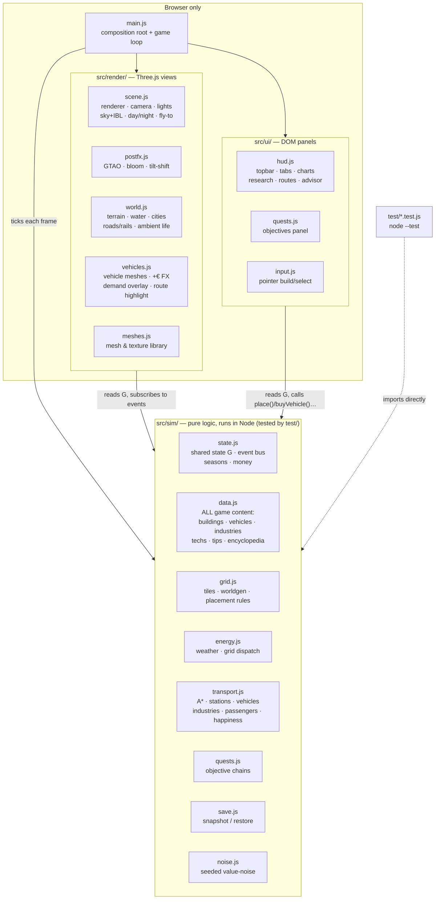

# Architecture & Design Decisions

## Overview

The game is plain ES modules with no build step, organized in **three strict
layers** plus a composition root. The rule that keeps everything testable:

> **`src/sim/` is the game.** It never imports Three.js or touches the DOM,
> so the entire simulation runs headless in Node (`npm test`).
> `src/render/` and `src/ui/` are *views* of sim state — they read the shared
> state object `G` every frame and react to sim events. Data flows down,
> events flow up.



Per-frame data flow (`main.js#frame`):

```
real dt → game minutes (8 min/s × speed)
  sim:    updateWeather → tickGrid → tickIndustries → tickVehicles
          → tickCities → tickResearch → sampleHistory
  render: updateWorldRender (roads/rails dirty-rebuild, water, ambient life)
          → updateVehicleRender (mesh poses, FX, overlays) → updateDayNight
  ui:     updateQuestPanel → updateUI → render
```

### The event bus

`state.js` exports a 5-line emitter (`on`/`emit`). The sim announces what
happened; renderers and UI decide what that looks like. The important events:

| Event | Emitted by | Consumed by |
|---|---|---|
| `placed` / `bulldozed` | grid.js | render/world.js (create/remove building mesh) |
| `roadBuilt` / `railBuilt` | grid.js | render/world.js (mark instanced layer dirty) |
| `vehicleBought` / `wagonAdded` / `vehicleSold` | transport.js | render/vehicles.js (mesh lifecycle) |
| `moneyFx` | transport.js | render/vehicles.js (floating +€ text) |
| `tip` | sim (various) | ui/hud.js (one-shot advisor toast) |
| `toast` | quests.js | ui/hud.js (generic toast) |
| `plantBuilt` / `stationBuilt` | grid.js | ui/hud.js (teaching tips) |
| `flyTo` | ui/quests.js | render/scene.js (camera tween) |

This is also why **save/load is small**: `restore()` replays the player's
builds through the normal `place()`/`buyVehicle()` calls, and the renderer
rebuilds every mesh just by listening.

## Key decisions (ADR-style)

### 1. Browser + Three.js, no build step
**Decision:** Plain ES modules, Three.js via CDN import map, served statically.
**Why:** "Run instantly on the user's machine" beat tooling comfort. No
node_modules, no bundler config, no version churn; `python3 serve.py` is the
whole toolchain. Three.js gives the modern look (PCF soft shadows, ACES
tonemapping, fog, emissive night windows) at zero install cost.
**Trade-off:** no TypeScript, no tree-shaking, CDN needed on first load.
**Consequence for contributors:** browsers cache modules aggressively; after
editing, force-refresh with `fetch(file, {cache:'reload'})` then reload
(see the `playtest-game` skill). `serve.py` sends `Cache-Control: no-cache`
to soften this.

### 2. Sim / render / ui layering (the testability decision)
**Decision:** All game rules live in `src/sim/` which imports neither
Three.js nor the DOM. Renderers subscribe to sim events and read `G`;
UI calls sim functions. `main.js` is the only file that knows all three.
**Why:** The simulation *is* the product (the teaching content); it must be
verifiable without a browser. `node --test` runs the whole suite in ~100 ms
with zero dependencies — cheap enough to run on every change.
**Consequence:** a feature = sim change + test + (optionally) a view change.
If you can't test it, it's probably in the wrong layer.

### 3. One shared state object instead of ECS/framework
**Decision:** `sim/state.js` exports a single mutable `G`; modules import and
mutate it. `resetState()` restores a pristine `G` for tests.
**Why:** The sim is small (a few hundred entities); an ECS or store layer
would be ceremony. Everything inspectable as `window.G` in DevTools — which is
also how the game is play-tested programmatically (`window.DEBUG`).

### 4. All tuning data lives in `sim/data.js`
**Decision:** buildings, vehicles, industry chains, research tree, advisor
texts and encyclopedia are pure data in one file.
**Why:** The teaching mission means numbers get revised against reality often;
balance changes must not require touching sim code. Every number's real-world
anchor is documented in [ENERGY-MODEL.md](ENERGY-MODEL.md).

### 5. Single "copper plate" grid, no transmission
**Decision:** One region-wide energy balance; no power lines or grid topology.
**Why:** The lesson hierarchy is: (1) variability of renewables, (2) storage
economics (battery vs H₂), (3) flexible demand. Transmission is lesson #4 and
would double UI complexity (line building, congestion). Deliberately deferred.

### 6. Merit-order dispatch with storage as the only dispatchables
**Decision:** every tick: renewables → (surplus: battery charge → electrolyzer
→ curtail) / (deficit: battery discharge → fuel cell → blackout).
**Why:** This mirrors how a 100%-renewable grid actually balances, and each
branch of the dispatch IS a teaching moment (curtailment tip, blackout tip,
flexible-demand tip). The electrolyzer is modeled as *flexible load that only
consumes surplus* — the single most important modern-grid concept the game
teaches. **This ordering is pinned by `test/energy.test.js` — don't change
one without the other.**

### 7. The player is the utility
**Decision:** cities & industries pay the player €85/MWh served; blackouts
forfeit revenue, halt industry, stop trains and shrink cities. Fleet charging
is unbilled (it's the player's own load).
**Why:** In OpenTTD energy would be a cost line; making it a *revenue stream*
makes the energy game a first-class economic loop instead of a chore, and
naturally rewards reliability — exactly the real-world incentive.

### 8. Tile world + graph roads, full 3D rendering
**Decision:** 96×96 logical tile grid (placement, A*, occupancy) under a
continuous displaced-plane terrain; cities generate their own street grids
which player roads connect to; rivers crossable via bridges (5× cost).
Rail is a *flag* on tiles, not a tile type, so roads and rails cross at level
crossings. The world is deterministic from a fixed seed (`WORLD_SEED`), which
is what lets saves store only the player's deltas.
**Why:** Tiles keep simulation and placement trivial (OpenTTD heritage);
the smooth mesh + lighting carry the visual ambition. Vehicles do A* over
road (or rail) tiles, so player roads, city streets and bridges form one
network.

### 9. Ambient life is cosmetic and instanced
**Decision:** ambient cars/pedestrians are `InstancedMesh` agents doing random
walks on street tiles (peds drift toward bus stops), count scaled by
population. They live entirely in `render/world.js` — the sim doesn't know
they exist.
**Why:** The requirement is the world *feels* alive. Agent-based citizen sim
costs enormous complexity for no teaching value. Two instanced draw calls give
hundreds of moving entities at negligible cost.

### 10. Passengers are demand pools with destinations
**Decision:** each city accumulates travellers (local + gravity-model split to
other cities); they walk to a stop only if a vehicle-staffed route through
that stop can actually deliver them (local = 2nd stop ≥5 tiles away in the
same city; intercity = a stop near the destination). Vehicles carry typed
groups and get paid per delivered passenger (€9 local / €24 intercity,
distance bonus).
**Why:** "carry pax between two cities" alone made intra-city lines useless
and demand invisible. Pools + the 👥 demand overlay (V) turn passenger work
into a read-the-map puzzle, and the no-clogging rule keeps stops from filling
with travellers nobody serves.

### 11. Trains are grid-coupled, battery-free
**Decision:** locomotives draw ~1 MW live traction power while moving; a
strained grid slows them, a blackout stops them. Capacity comes from wagons.
**Why:** That's how real electric railways work (catenary, no battery), and it
closes the loop between the two halves of the game: your railway is only as
reliable as your grid.

### 12. Teaching via event-triggered advisor, not tutorial gates
**Decision:** ~15 one-shot tips fire when the *simulation* first produces the
phenomenon (first curtailment, first blackout, Dunkelflaute warning, storm
cut-out…), plus a passive encyclopedia tab and three quest chains that
sequence the arc without gating the sandbox.

### 13. Time scale
**Decision:** 1 game day = 3 real minutes at 1× (speeds ×1/×3/×10, pause);
seasons of 7 days change day length, solar yield, wind and heating demand.
**Why:** Solar's day cycle is the core rhythm; it must be observable within a
play session. Winter (short days, high demand) is the argument for hydrogen.

### 14. Zero-dependency test suite
**Decision:** `test/` uses Node's built-in runner (`node --test`), importing
`src/sim/` directly. `package.json` exists only for `npm test` and
`"type": "module"` — there are still no dependencies to install.
**Why:** The no-build philosophy extends to testing: cloning the repo and
running `npm test` must always work offline in under a second.

### 15. Rendering pipeline: physical sky, IBL, post-processing
**Decision:** `render/scene.js` renders a physical `Sky` dome (three.js addon,
r185+) whose sun tracks the game clock and whose procedural cloud cover is
driven by the sim's `G.cloud` — an overcast sky *is* the reason solar output
is low. A second, sun-disc-less Sky instance is baked into a PMREM environment
map (re-baked whenever the sun has moved enough) so PBR materials get sky
bounce light. `render/postfx.js` owns the frame composition: render →
GTAO → bloom (HDR, threshold above sun-lit whites so only emissives glow) →
tone map → screen-space tilt-shift whose strength scales with zoom-out.
`DEBUG.setPostFX(false)` falls back to a plain render for weak GPUs.
**Why:** IBL + ambient occlusion + the "miniature" tilt-shift are what make a
low-poly city read as a modern city-builder; all of it is post/lighting, so
the sim and content layers are untouched.
**Traps:** the bloom threshold (3.4) must stay above the HDR luminance of
sun-lit white surfaces (~2.8) or the whole city glows; night window emissive
(4.5) must stay above it. r185 removed `PCFSoftShadowMap` — its lazy fallback
leaves compiled materials without shadow lookups, so the renderer must be
configured with `PCFShadowMap` explicitly.

### 16. glTF assets from scripted Blender (graphics phase 2)
**Decision:** Real 3D models replace the box geometry incrementally, one type
at a time (pilot: the wind turbine). Each asset is generated by a
deterministic Python script in `tools/models/` run through headless Blender
(`tools/build-models.sh`), and the resulting `.glb` is committed to
`assets/models/` — players download static files, never run tooling.
`render/assets.js` loads them all once at startup (`await loadModels()` in
`main.js`, top-level await, before `initWorldRender`); `buildPlantMesh(type)`
returns a glTF instance when one exists and falls back to the procedural
mesh otherwise, so a missing/failed asset degrades gracefully.
**Why:** scripted Blender keeps assets reproducible and diffable (the script
is the source, the GLB a build artifact small enough to commit), preserving
the no-build-step rule at play time. See `docs/GRAPHICS-PHASE2-PLAN.md`.
**Traps:** `loadModels()` must complete before the render layer subscribes to
`placed` — save restore replays `place()` during init. Rotor nodes must
export with identity rotation (world.js animates `rotation.x` directly);
`tools/models/wind_turbine.py` documents how. Node/material names are API:
`assets.js` looks nodes up by name (`rotor`), so keep them stable across
regenerations. glTF materials arrive as `MeshStandardMaterial` — don't
re-wrap; keep roughness ≥ ~0.5 on whites (bloom threshold, ADR 15), keep
metalness ≤ ~0.25 on painted surfaces (metalness greys out albedo), and pick
albedos darker than the target look (noon ACES bleaches mid-tones).
`build-models.sh` finishes each asset with gltf-transform in dedup+weld-only
mode — join/flatten/palette would merge nodes and destroy those names, and
quantization re-centers vertex data into node transforms, breaking the
rotor's hub pivot and the raw-geometry building/tree preps (learned the hard
way: tiny city, off-axis rotors). City buildings and trees don't clone scene graphs: assets.js
merges them into instancing-ready geometries (flat material colors baked into
vertex colors; building windows keep a second material group whose emissive
map is the runtime-generated night-lights atlas).

## Persistence

`sim/save.js` — autosave to localStorage every 10 s and on `pagehide`.
`snapshot()` captures economy + player deltas (roads, rails, plants, stations,
routes, vehicles, wagons, quest/tech progress); `restore()` replays them onto
a freshly generated world. Both are pure and covered by `test/save.test.js`.

## Known limitations / roadmap

- Transmission constraints (ADR #5) deferred — the natural "lesson 4"
- No ships; no dynamic electricity pricing / demand response
- Road L-path drag can silently skip blocked tiles (preview shows red, but a
  gap check would be friendlier)
- Vehicle path caching: A* runs per leg per vehicle; fine at current fleet
  sizes, revisit beyond ~100 vehicles
