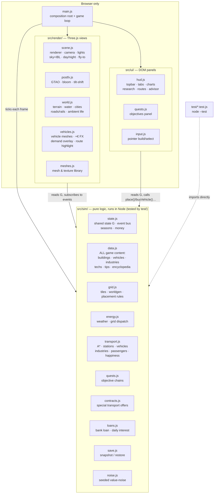

# Architecture & Design Decisions

## Overview

The game is plain ES modules with no build step, organized in **three strict
layers** plus a composition root. The rule that keeps everything testable:

> **`src/sim/` is the game.** It never imports Three.js or touches the DOM,
> so the entire simulation runs headless in Node (`npm test`).
> `src/render/` and `src/ui/` are *views* of sim state — they read the shared
> state object `G` every frame and react to sim events. Data flows down,
> events flow up.



Per-frame data flow (`main.js#frame`):

```
real dt → game minutes (8 min/s × speed)
  sim:    updateWeather → tickGrid → tickIndustries → tickVehicles
          → tickCities → tickContracts → tickResearch → sampleHistory
  render: updateWorldRender (roads/rails dirty-rebuild, water, ambient life)
          → updateVehicleRender (mesh poses, FX, overlays) → updateDayNight
  ui:     updateQuestPanel → updateUI → render
```

### The event bus

`state.js` exports a 5-line emitter (`on`/`emit`). The sim announces what
happened; renderers and UI decide what that looks like. The important events:

| Event | Emitted by | Consumed by |
|---|---|---|
| `placed` / `bulldozed` | grid.js | render/world.js (create/remove building mesh) |
| `roadBuilt` / `railBuilt` | grid.js | render/world.js (mark instanced layer dirty) |
| `vehicleBought` / `wagonAdded` / `vehicleSold` | transport.js | render/vehicles.js (mesh lifecycle) |
| `moneyFx` | transport.js | render/vehicles.js (floating +€ text) |
| `tip` | sim (various) | ui/hud.js (one-shot advisor toast) |
| `toast` | quests.js, contracts.js | ui/hud.js (generic toast) |
| `contractsChanged` | contracts.js | ui/hud.js (re-render 📜 tab) |
| `plantBuilt` / `stationBuilt` | grid.js | ui/hud.js (teaching tips) |
| `flyTo` | ui/quests.js | render/scene.js (camera tween) |

This is also why **save/load is small**: `restore()` replays the player's
builds through the normal `place()`/`buyVehicle()` calls, and the renderer
rebuilds every mesh just by listening.

## Key decisions (ADR-style)

### 1. Browser + Three.js, no build step
**Decision:** Plain ES modules, Three.js via CDN import map, served statically.
**Why:** "Run instantly on the user's machine" beat tooling comfort. No
node_modules, no bundler config, no version churn; `python3 serve.py` is the
whole toolchain. Three.js gives the modern look (PCF soft shadows, ACES
tonemapping, fog, emissive night windows) at zero install cost.
**Trade-off:** no TypeScript, no tree-shaking, CDN needed on first load.
**Consequence for contributors:** browsers cache modules aggressively; after
editing, force-refresh with `fetch(file, {cache:'reload'})` then reload
(see the `playtest-game` skill). `serve.py` sends `Cache-Control: no-cache`
to soften this.

### 2. Sim / render / ui layering (the testability decision)
**Decision:** All game rules live in `src/sim/` which imports neither
Three.js nor the DOM. Renderers subscribe to sim events and read `G`;
UI calls sim functions. `main.js` is the only file that knows all three.
**Why:** The simulation *is* the product (the teaching content); it must be
verifiable without a browser. `node --test` runs the whole suite in ~100 ms
with zero dependencies — cheap enough to run on every change.
**Consequence:** a feature = sim change + test + (optionally) a view change.
If you can't test it, it's probably in the wrong layer.

### 3. One shared state object instead of ECS/framework
**Decision:** `sim/state.js` exports a single mutable `G`; modules import and
mutate it. `resetState()` restores a pristine `G` for tests.
**Why:** The sim is small (a few hundred entities); an ECS or store layer
would be ceremony. Everything inspectable as `window.G` in DevTools — which is
also how the game is play-tested programmatically (`window.DEBUG`).

### 4. All tuning data lives in `sim/data.js`
**Decision:** buildings, vehicles, industry chains, research tree, advisor
texts and encyclopedia are pure data in one file.
**Why:** The teaching mission means numbers get revised against reality often;
balance changes must not require touching sim code. Every number's real-world
anchor is documented in [ENERGY-MODEL.md](ENERGY-MODEL.md).

### 5. Single "copper plate" grid, no transmission
**Decision:** One region-wide energy balance; no power lines or grid topology.
**Why:** The lesson hierarchy is: (1) variability of renewables, (2) storage
economics (battery vs H₂), (3) flexible demand. Transmission is lesson #4 and
would double UI complexity (line building, congestion). Deliberately deferred.

### 6. Merit-order dispatch with storage as the only dispatchables
**Decision:** every tick: renewables → (surplus: battery charge → electrolyzer
→ curtail) / (deficit: battery discharge → fuel cell → blackout).
**Why:** This mirrors how a 100%-renewable grid actually balances, and each
branch of the dispatch IS a teaching moment (curtailment tip, blackout tip,
flexible-demand tip). The electrolyzer is modeled as *flexible load that only
consumes surplus* — the single most important modern-grid concept the game
teaches. **This ordering is pinned by `test/energy.test.js` — don't change
one without the other.**

### 7. The player is the utility
**Decision:** cities & industries pay the player €85/MWh served; blackouts
forfeit revenue, halt industry, stop trains and shrink cities. Fleet charging
is unbilled (it's the player's own load).
**Why:** In OpenTTD energy would be a cost line; making it a *revenue stream*
makes the energy game a first-class economic loop instead of a chore, and
naturally rewards reliability — exactly the real-world incentive.

### 8. Tile world + graph roads, full 3D rendering
**Decision:** 192×192 logical tile grid (placement, A*, occupancy) under a
continuous displaced-plane terrain; cities generate their own street grids
which player roads connect to; rivers crossable via bridges (5× cost).
Rail is a *flag* on tiles, not a tile type, so roads and rails cross at level
crossings. The world is deterministic from a fixed seed (`WORLD_SEED`), which
is what lets saves store only the player's deltas.
**Why:** Tiles keep simulation and placement trivial (OpenTTD heritage);
the smooth mesh + lighting carry the visual ambition. Vehicles do A* over
road (or rail) tiles, so player roads, city streets and bridges form one
network.

### 9. Ambient life is cosmetic and instanced
**Decision:** ambient cars/pedestrians are `InstancedMesh` agents doing random
walks on street tiles (peds drift toward bus stops), count scaled by
population. They live entirely in `render/world.js` — the sim doesn't know
they exist.
**Why:** The requirement is the world *feels* alive. Agent-based citizen sim
costs enormous complexity for no teaching value. Two instanced draw calls give
hundreds of moving entities at negligible cost.

### 10. Passengers are demand pools with destinations
**Decision:** each city accumulates travellers (local + gravity-model split to
*neighbouring* cities only — the relative neighbourhood graph built in
`grid.js buildCityNeighbors`, where two cities are neighbours unless a third
sits between them); they walk to a stop only if a vehicle-staffed route
through that stop can actually deliver them (local = 2nd stop ≥5 tiles away
in the same city; intercity = a stop near the destination). Vehicles carry
typed groups and get paid per delivered passenger (€9 local / €24 intercity,
distance bonus). Happiness likewise only asks for links to neighbours.
**Why neighbours only:** on the 8-city map, all-pairs demand meant every city
wanted direct lines to seven others — unreadable overlay, unwinnable
happiness, and no reason for a hub-and-spoke network. The RNG graph contains
the minimum spanning tree, so the whole region is still reachable via
neighbour hops, and central cities naturally become transfer hubs. Non-
neighbour pools are actively drained each tick so stale saves can't strand
phantom travellers.
**Why:** "carry pax between two cities" alone made intra-city lines useless
and demand invisible. Pools + the 👥 demand overlay (V) turn passenger work
into a read-the-map puzzle, and the no-clogging rule keeps stops from filling
with travellers nobody serves.

### 11. Trains are grid-coupled, battery-free
**Decision:** locomotives draw ~1 MW live traction power while moving; a
strained grid slows them, a blackout stops them. Capacity comes from wagons.
**Why:** That's how real electric railways work (catenary, no battery), and it
closes the loop between the two halves of the game: your railway is only as
reliable as your grid.

### 12. Teaching via event-triggered advisor, not tutorial gates
**Decision:** ~15 one-shot tips fire when the *simulation* first produces the
phenomenon (first curtailment, first blackout, Dunkelflaute warning, storm
cut-out…), plus a passive encyclopedia tab and three quest chains that
sequence the arc without gating the sandbox.

### 13. Time scale
**Decision:** 1 game day = 3 real minutes at 1× (speeds ×1/×3/×10, pause);
seasons of 7 days change day length, solar yield, wind and heating demand.
**Why:** Solar's day cycle is the core rhythm; it must be observable within a
play session. Winter (short days, high demand) is the argument for hydrogen.

### 14. Zero-dependency test suite
**Decision:** `test/` uses Node's built-in runner (`node --test`), importing
`src/sim/` directly. `package.json` exists only for `npm test` and
`"type": "module"` — there are still no dependencies to install.
**Why:** The no-build philosophy extends to testing: cloning the repo and
running `npm test` must always work offline in under a second.

### 15. Rendering pipeline: physical sky, IBL, post-processing
**Decision:** `render/scene.js` renders a physical `Sky` dome (three.js addon,
r185+) whose sun tracks the game clock and whose procedural cloud cover is
driven by the sim's `G.cloud` — an overcast sky *is* the reason solar output
is low. A second, sun-disc-less Sky instance is baked into a PMREM environment
map (re-baked whenever the sun has moved enough) so PBR materials get sky
bounce light. `render/postfx.js` owns the frame composition: render →
GTAO → bloom (HDR, threshold above sun-lit whites so only emissives glow) →
tone map → screen-space tilt-shift whose strength scales with zoom-out.
`DEBUG.setPostFX(false)` falls back to a plain render for weak GPUs.
**Why:** IBL + ambient occlusion + the "miniature" tilt-shift are what make a
low-poly city read as a modern city-builder; all of it is post/lighting, so
the sim and content layers are untouched.
**Traps:** the bloom threshold (3.4) must stay above the HDR luminance of
sun-lit white surfaces (~2.8) or the whole city glows; night window emissive
(4.5) must stay above it. r185 removed `PCFSoftShadowMap` — its lazy fallback
leaves compiled materials without shadow lookups, so the renderer must be
configured with `PCFShadowMap` explicitly.

### 16. glTF assets from scripted Blender (graphics phase 2)
**Decision:** Real 3D models replace the box geometry incrementally, one type
at a time (pilot: the wind turbine). Each asset is generated by a
deterministic Python script in `tools/models/` run through headless Blender
(`tools/build-models.sh`), and the resulting `.glb` is committed to
`assets/models/` — players download static files, never run tooling.
`render/assets.js` loads them all once at startup (`await loadModels()` in
`main.js`, top-level await, before `initWorldRender`); `buildPlantMesh(type)`
returns a glTF instance when one exists and falls back to the procedural
mesh otherwise, so a missing/failed asset degrades gracefully.
**Why:** scripted Blender keeps assets reproducible and diffable (the script
is the source, the GLB a build artifact small enough to commit), preserving
the no-build-step rule at play time. See `docs/GRAPHICS-PHASE2-PLAN.md`.
**Traps:** `loadModels()` must complete before the render layer subscribes to
`placed` — save restore replays `place()` during init. Rotor nodes must
export with identity rotation (world.js animates `rotation.x` directly);
`tools/models/wind_turbine.py` documents how. Node/material names are API:
`assets.js` looks nodes up by name (`rotor`), so keep them stable across
regenerations. glTF materials arrive as `MeshStandardMaterial` — don't
re-wrap; keep roughness ≥ ~0.5 on whites (bloom threshold, ADR 15), keep
metalness ≤ ~0.25 on painted surfaces (metalness greys out albedo), and pick
albedos darker than the target look (noon ACES bleaches mid-tones).
`build-models.sh` finishes each asset with gltf-transform in dedup+weld-only
mode — join/flatten/palette would merge nodes and destroy those names, and
quantization re-centers vertex data into node transforms, breaking the
rotor's hub pivot and the raw-geometry building/tree preps (learned the hard
way: tiny city, off-axis rotors). City buildings and trees don't clone scene graphs: assets.js
merges them into instancing-ready geometries (flat material colors baked into
vertex colors; building windows keep a second material group whose emissive
map is the runtime-generated night-lights atlas).

### 17. Runtime canvas textures over world-space UVs (graphics phase 2)
**Decision:** The GLBs carry no image textures. Instead the Blender scripts
box/cylinder-project UVs in *world space* (1 UV unit = 1 world unit,
`common.py box_uv/cyl_uv`), and `render/textures.js` generates small tileable
canvas textures (brick, stucco, planks, corrugated metal, concrete, shingles,
PV cells, paving…) at load and attaches them to loaded materials **by
material name**. Each generator paints around the material's own base color
and the color then moves into the map (material.color becomes white) — the
authored palette (ADR 15/16 bloom/ACES tuning) is preserved exactly, and
per-instance tints keep working. City buildings merge into a material group
per texture category (flat/brick/plaster/window) with a per-model materials
array. World-space UVs mean texel density is uniform across parts of any
size, so one 128px texture serves every wall.
**Why:** keeps GLBs tiny and diffable (no binary image churn), matches the
existing runtime-canvas pattern (terrain, roads, window lights), and lets
textures be tuned in JS without a Blender round-trip.
**Traps:** all HSL color math in textures.js happens explicitly in sRGB —
three's linear working space makes dark colors' lightness tiny, and offsets
computed there blow the albedo far past the authored palette. And
`build-models.sh` must pass `--prune-attributes false`: gltf-transform
otherwise strips TEXCOORD_0 as "unused" (no material references an image),
which silently broke the building window-light atlas once before.

### 18. Terrain: baked biome map + tiling detail layer (graphics phase 2)
**Decision:** The ground keeps its single baked biome texture (3072px canvas,
`world.js bakeTerrainTexture`) for the macro look — river bed, sand banks,
grass patches, rocky highland. Close-up crispness comes from a separate
256px *tiling* detail layer (`makeGroundDetailMaps`): a hue-neutral grain
multiplied into the albedo via `onBeforeCompile` (reads as grass blades on
grass, granules on sand) plus a normal map from the same heightfield for
micro-relief. The detail repeats once per tile and fades out between 60 and
170 units of camera distance, so the repeat never shows as a pattern from
above.
**Why:** one all-island texture can never hold street-level detail (3072px ≈
4 texels per world unit on the 768-unit map); scaling it further costs quadratic bake time and
memory, while a small repeating layer is sharp at any zoom for free. The
detail noise is value noise on wrapped lattices so the texture tiles
seamlessly without mirroring artifacts.
**Traps:** the detail albedo is deliberately *linear* (no sRGB flag) and
centered on gray 128 — the shader multiplies `detail × 2`, so a mean of 0.5
leaves overall brightness unchanged. Per-map `repeat` on the normal map only
works because three r152+ gives every texture its own UV transform.

### 19. Detailed vehicles & citizens (graphics phase 2)
**Decision:** The glTF vehicles (`tools/models/vehicles.py`) and the instanced
ambient life (`world.js`) get real detail instead of flat-colored boxes.
Vehicle bodies are edge-beveled (a new `common.py bevel()` — angle-limited
modifier + box-UV reprojection + smooth shading), wheels are two parts (dark
tyre + a bright alloy rim that pokes through both sides), and each vehicle
gains headlights/taillights, side mirrors, a grille/destination sign and
window pillars that break the glass band into panes. Head/tail lamps are
*emissive*: `common.material()` now takes `emit`/`emit_str`, exported as glTF
`emissiveFactor` + `KHR_materials_emissive_strength` and kept verbatim by the
loader (they read as lit lamps at night, tuned below the bloom threshold).
Painted panels and tyres pick up subtle runtime textures by material name
(`textures.js` `vehiclePaint` — metallic flake + clear-coat sheen, matte; and
`tyre` — tread lugs + circumferential grooves). Ambient cars go from body+cab
to body + greenhouse + tinted glass + four wheels; pedestrians go from a
single capsule to trousers + torso + skin head. Both stay ONE `InstancedMesh`
each: a per-part vertex-color multiplier gives fixed-dark parts (glass, tyres,
trousers) while `setColorAt` still tints the body/shirt per instance.
**Why:** vehicles and citizens are what the eye tracks, so they gained the
most from box → real geometry; keeping ambient life single-instanced preserves
the ADR 9 "cosmetic and instanced" budget (still 121 fps orbiting, 160 cars +
240 peds). Emissive lamps reuse the existing material path rather than a new
night hook — vehicles have no `setNightAmount` wiring and modest emission looks
right day and night.
**Traps:** `bevel()` must run *before* `join_parts` (per-object modifier) and
re-project box UVs (new bevel faces have no coords); it only fits box-projected
parts. Keep `emit_str` below the bloom threshold (~3.4) or lamps flare in sun.
The vehicle-paint texture must stay near-flat (tiny lightness spread, no bump)
or painted bodies bloom — same rule as ADR 16. Ambient vertex colors are
*multipliers*, not final colors: a part tinted white takes the instance color,
a part tinted gray stays that gray whatever the body color.

### 20. 4× world: 192×192 tiles, 8 cities, multi-producer chains
**Decision:** the map grew from 96×96 to 192×192 tiles (4× area) with 8 cities
and 9 industries (2 mines, 2 steel works, 3 farms, 2 food plants), so every
cargo chain has alternative producers and intercity routes have real length.
City density is deliberately *below* the old map's (8 instead of a
proportional 12) — distance is the point. Both mines sit east of the river so
west-bank steel keeps the bridge lesson. The starter grid and the storagePlay
quest target scaled with regional demand (~23 MW evening peak) to keep the
same early-game margins. Save version bumped to v2 (new localStorage key):
v1 saves store tile coords of the old world and would silently mis-restore;
the old key is left untouched rather than deleted.
**Why 8 cities / 9 industries:** enough that route choice becomes a decision
(which farm feeds which food plant, rail vs truck over 60-tile hauls) without
multiplying early-game demand beyond what a teaching-sized starter grid can
serve.
**Traps:** anything that scales per-tile (terrain bake, tree scatter, detail
repeat) must derive from `G.N`, not literals — the terrain texture and
`DETAIL_REPEAT` both bit on this. Tests keep synthetic road/rail fixtures in
the empty south-west (i 1–21, j 84–92); new cities must stay clear of it.

### 21. Legacy gas bridge & rising carbon price (amends ADR 6)
**Decision:** every new game starts with exactly one inherited 30 MW gas plant
(`legacy: true` in `data.js` — hidden from the build palette, players can
never build fossil capacity). It extends the pinned merit order by one step:
deficit → battery → fuel cell → **gas** → blackout. Each gas MWh costs fuel
(€70) plus `co2PerMWh × G.carbonPrice`, with the carbon price starting at
€30/t and rising €3 per game day (`data.js` CARBON block); emissions accrue
in `G.co2EmittedTons` next to the existing avoided-CO₂ ledger. A one-time
decommission grant (€60k) removes the plant irreversibly, and a "fossil-free
week" quest (7 consecutive days with zero gas) is the game's de-facto win
condition.
**Why:** headless experiments showed the starter grid blacks out from day 5
with no early-game defense — new players lost to weather before the teaching
arc began. A *bridge* plant keeps the lights on early while the carbon ramp
guarantees it becomes a loss-maker (break-even ≈ €33/t, i.e. day 2), turning
the whole game into the real energy-transition problem: phase out fossil
without blackouts. ADR 6's "storage as the only dispatchables" becomes
"…plus a single legacy gas plant whose phase-out is the game arc."
**Invariant (tested):** fossil must never be the profitable long-run answer —
gas margin is negative once carbonPrice > €35/t.
**Shared-state contract** (pinned in `state.js`, save v3): `carbonPrice`,
`co2EmittedTons`, `gasMWhToday`, `gasCostToday`, `fossilFreeDays`,
`gasDecommissioned`, `supply.gas`, plus `weatherFront`/`forecast` (ADR-noted
under F2), `reports` (daily report cards), `marketLive`/`price` (ADR 22).
Save format bumps to v3 under the same localStorage key; v2 saves still
restore (same world seed) and simply have no gas plant — it is only placed
for new games.

### 22. Smart Market: dynamic electricity pricing (supersedes the "no dynamic pricing" limitation)
**Decision:** on game day 8 the regulator *announces*, and on day 10
*activates*, the Smart Market: the flat €85/MWh is replaced by a live price
`G.price` set each tick by teachable rules, in priority order — scarcity
(unserved demand) €240 · gas running: gas marginal cost + €15 (the most
expensive running plant sets the price — the merit-order lesson) · surplus
being curtailed €25 · otherwise €45→€120 interpolated by residual load
(demand − renewables) against the evening peak. Revenue = billable MW ×
current price; constants live in `data.js` MARKET.
**Why:** with a flat tariff, storage only prevents *losses*; real grids pay
for flexibility. Once batteries and fuel cells discharge into €240 scarcity
prices, storage arbitrage becomes the business model — and the two-day
announcement window teaches players to prepare, mirroring how market reforms
actually arrive. The day-10 start protects the early game (players learn the
basics on a predictable tariff first).
**Trade-off:** income becomes weather-correlated; balance is checked by a
15-day headless run against the flat-price baseline (±30 % band) — tune the
band constants, not the mechanism.

### 23. Weather fronts with lead time
**Decision:** the hourly weather roll no longer applies Dunkelflaute/storm
instantly; it schedules a front on `G.weatherFront` with 10–14 h lead time
(`data.js` FORECAST), applied unchanged when the countdown ends, with a
derived `G.forecast` outlook and a warning banner/advisor tip at schedule
time. **Why:** this turns the Dunkelflaute from an ambush into a planning
problem — the event stays exactly as hard, players just get the real-world
day-ahead-forecast window to charge storage; it also softens the day-3 grace
analysis of ADR 21, since the first flaute now announces itself ~half a day
early. The forced-event debug path (`G.dunkelflaute = 40` applies on the next
tick) is preserved and pinned by `test/weather.test.js`.

### 24. Climate feedback: emissions load the weather dice
**Decision:** the lifetime CO₂ emitted by the gas plant multiplies the hourly
*extreme*-event probabilities (storm and the new summer-only **heatwave**) by
`min(2, 1 + emitted/1500 t)` — the base Dunkelflaute roll stays unscaled, since
a dark calm is ordinary weather variability, not a warming signature. The
heatwave rides the ADR 23 front pipeline (scheduled 10–14 h ahead, forecast +
banner) and models a heat dome: city demand ×1.3 (air conditioning) while the
wind drift target is capped low (stagnant air) and skies stay clear (solar
strong). **Why:** it closes the game's causal loop — gas → CO₂ → worse
weather → harder grid — which is climate attribution in miniature, and it
gives the emitted-CO₂ ledger (ADR 21) a consequence beyond the carbon bill.
All constants live in `data.js` CLIMATE; the 2× cap keeps it teaching, not
punishment. Active state `G.heatwave` (+ `heatHoursToday`) persists as
backwards-safe v3 save fields — no version bump.

### 25. Grid-import interconnector (extends the ADR 21 merit order)
**Decision:** a buildable 12 MW HVDC **Interconnector** adds one deficit step:
battery → fuel cell → **import** → gas → blackout. Imports cost the
neighbour's price (€95/MWh normally) and put the neighbour's mix CO₂
(0.25 t/MWh) on the player's *emitted* ledger (climate dice included, avoided-
CO₂ credit excluded). While a Dunkelflaute or heatwave is active the link
carries only 30 % of its capacity at €220/MWh — weather systems are
continental, the neighbours are short too. On the Smart Market the most
expensive *running* dispatchable sets the price: `max(gas ask, import ask)`
where the import ask is its current price + €10. Constants in `data.js`
`INTERCONNECT`; capacity registers like storage (`G.importCapMW`).
**Why:** interconnection is the real fourth tool of grid planners (after
generation, storage, flexibility) and it gives players a fossil-free path to
retire the gas plant — imports clear *before* gas because the carbon ramp
pushes the gas marginal cost past €95 within days (a deliberate fixed-order
simplification of true merit order; for the first ~2 days gas would actually
be cheaper). The event throttle preserves the teaching invariant that a
Dunkelflaute must not be escapable by wire alone, and the €95-vs-€85 flat
tariff spread keeps imports an insurance product, not a business model.
Imports do **not** break the fossil-free-week streak (that quest is about the
player's own plant) — but the CO₂ ledger and the ADR 24 climate feedback see
them, so "fossil-free by import" is visibly not emissions-free.

### 26. H₂ offtake: hydrogen becomes a product (sector coupling)
**Decision:** a buildable **E-Fuel Refinery** sells up to 4 MW (chemical) of
grid hydrogen into offtake contracts at €95/MWh — but only the amount above a
**40 % tank reserve**, which is never sold (`data.js` H2OFFTAKE,
`energy.js#tickGrid` after dispatch). Sales are chemical, not electrical: they
never appear in the merit order or set the power price. Each sold MWh credits
0.25 t *avoided* CO₂ (e-fuel displaces fossil kerosene/diesel downstream). A
new energy quest ("🛢 Hydrogen economy", 300 MWh sold) follows the H₂-reserve
quest.
**Why:** with only the fuel cell as H₂ sink, overbuilt electrolyzers were dead
capital outside Dunkelflauten; an offtake contract makes routine surplus →
molecules a business — the real sector-coupling story. The price is pinned
between the €25 surplus power value and a scarcity fuel-cell discharge
(0.58 × €240 ≈ €139/MWh chemical), so selling routine surplus pays while
hoarding for emergencies pays better; the hard reserve keeps the teaching
invariant that a Dunkelflaute must remain survivable — the game never lets
the player's insurance be quietly sold out from under the fuel cells.

### 27. Vehicle aging & fleet renewal (save v4)
**Decision:** vehicles accrue calendar age (`v.ageDays`, ticked in
`tickVehicles`). Past a 10-day grace period, daily upkeep ramps +10 % of the
base rate per day (capped 3×, billed via `transport.js#vehicleUpkeep` from
`dailyUpkeep` and the report card) and EV packs lose 1.5 %/day of usable
capacity (floored at 65 %, `effectiveBatteryKWh`) — old trucks run shorter
legs and charge longer. `replaceVehicle()` trades in for 75 % of list price
and resets the clock; a per-route **auto-replace** flag renews ≥22-day
vehicles on the day rollover (`autoReplaceFleet`, called from `main.js`).
Constants in `data.js` AGING. Save format bumps to **v4** (same key): vehicle
`age` and route `autoReplace` persist; v2/v3 saves restore with everything
grandfathered in at age 0.
**Why:** without depreciation, a bought vehicle was a solved problem forever;
now fleets have the real operator's renewal trade-off (maintain vs replace),
and pack degradation ties transport back into the energy game — worn EVs
spend more time on the chargers your grid feeds. Numbers are gentle: a
never-replaced truck costs ~€90/day extra at the cap, noticeable in the
report card, never fatal.

### 28. Milestone-gated build palette (amends ADR 12's "no tutorial gates" — for buildings only)
**Decision:** advanced buildings unlock as play progresses: rail + rail
stations after the first freight-chain objective (`grainChain`), the whole H₂
chain (electrolyzer/tank/fuel cell) after the battery objective
(`storagePlay`), the e-fuel refinery after the H₂-reserve objective, and the
interconnector when the Smart Market goes live (day 10). Lock state is
**derived live** from `G` (`data.js` UNLOCKS predicates, `grid.js#isUnlocked`)
and never stored — loading a save recomputes it. Only the *palette* is gated:
locked tools render greyed with a 🔒 and clicking shows the unlock hint;
`canPlace()`/`place()` stay lock-free because the save replay, the starter
grid and the DEBUG API all go through them (a lock there would silently drop
restored buildings — pinned by test).
**Why:** the day-one palette had grown to 13 buildings across three systems;
new players built electrolyzers before understanding batteries and the
teaching sequence (variability → daily storage → seasonal storage → markets)
was skippable. The gates follow the existing quest chain, so they add no new
bookkeeping, and old saves simply start with whatever their progress already
earned. ADR 12's principle survives: the sandbox isn't paused or railroaded —
locked options are visible with a clear path to earn them.

### 29. Guided onboarding tutorial (opt-in, state-detected, never gating)
**Decision:** new games offer a 🎓 tutorial on the welcome screen (primary
button; "Free play" skips it silently). Nine steps walk the core loop —
camera, dashboard, first solar + battery, two bus stops, route, e-bus, first
riders, the objectives panel. Step definitions and completion logic live in
`sim/tutorial.js` (quest-style: polled `check()` predicates against `G`,
relative to baselines captured at start so the starter grid never counts);
the card UI, DOM highlighting and camera-move detection live in
`ui/tutorial.js`. Steps the sim can't see (camera moved, tab opened, quest
expanded) are reported by the UI via `notifyTutorial(flag)` — a plain sim
function call, honoring the layering rule. Each step carries a semantic
`highlight` key (`tool:solar`, `tab:routes`, …) that the UI maps to a
selector and pulses. Every step pays cash (€5–15k) and completion pays a
€25k graduation bonus, announced through the existing `toast` event.
`G.tutorial` persists in the save (optional field, no version bump); saves
without it restore as `done` so existing players are never onboarded.
**Why:** the welcome card + advisor tips explained the game but never made
the player DO anything — the first minutes decide whether a new player finds
the loop. ADR 12's principle still holds, the same way ADR 28 amended it:
the tutorial observes state, it never pauses or locks the sandbox, every
step can be completed out of order (checks are cumulative and cascade), and
it is skippable at any moment. Detection-by-state means the tutorial needs
no special hooks in game rules — it reads the same counters quests do.

## Persistence

`sim/save.js` — autosave to localStorage every 10 s and on `pagehide`.
`snapshot()` captures economy + player deltas (roads, rails, plants, stations,
routes, vehicles, wagons, quest/tech progress); `restore()` replays them onto
a freshly generated world. Both are pure and covered by `test/save.test.js`.

## Known limitations / roadmap

- Transmission constraints (ADR #5) deferred — the natural "lesson 4"
- No ships
- Road L-path drag can silently skip blocked tiles (preview shows red, but a
  gap check would be friendlier)
- Vehicle path caching: A* runs per leg per vehicle; fine at current fleet
  sizes, revisit beyond ~100 vehicles
